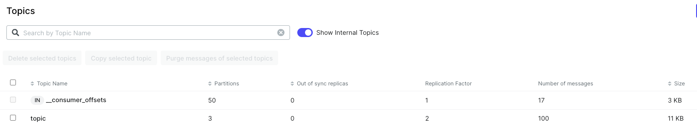

## Лабораторная работа 1

**Цель**: применить на практике знания об основах Apache Kafka, укрепить понимание её архитектуры, ключевых компонентов и возможностей.

**Тема проекта**: настройка кластера и реализация продюсера с двумя консьюмерами. 

## Быстрый старт

Структура проекта


Структура директорий

```
|_ lab_01
  |_ app
    |_ .env
    |_ Producer.py
    |_ SingleMessageConsumer.py
    |_ BatchMessageConsumer.py
    |_ Dockerfile
    |_ docker-compose.yml  # запуск приложения
  |_ docker-compose.yml    # запуск кластера
```

Команды запуска

```bash
# запускаем кластер
cd lab_01
docker-compose up -d

# заходим в любой контейнер с брокером
docker ps
docker exec -it <container_id_kafka> /bin/sh

# создаем топик
cd /opt/bitnami/kafka/bin
kafka-topics.sh --create --topic topic --bootstrap-server localhost:9092 --partitions 3 --replication-factor 2

# ctrl+D для выхода из контейнера

# запускаем приложение
cd app
docker-compose build
docker-compose up -d

# смотрим логи
docker logs -f <container_uid>
```

Ниже более подробно описаны команды запуска, а также структура и настройка кластера и приложения.

## Настройка кластера

### Установка Kafka через Docker

```bash
-- Запуск кластера
docker-compose up -d

-- Получить id контейнера с кафкой
docker ps

-- Проверить работоспособность (вывод должен быть пустым)
docker exec -it <id контейнера>  kafka-topics.sh --list --bootstrap-server kafka-0:9092 

-- Если ругается, что не удалось разрешить DNS, то вместо kafka-0 используем localhost
docker exec -it <id контейнера>  kafka-topics.sh --list --bootstrap-server localhost:9092 

-- Если все равно ругается, то можно получить IP контейнера и по нему обратиться
docker inspect -f '{{range .NetworkSettings.Networks}}{{.IPAddress}}{{end}}' <id контейнера>

-- Остановить 
docker-compose down
```

### Как сгенерировать ID кластера

*Решение проблемы Cluster ID string <ваш кластер ID> does not appear to be a valid UUID: Input string <ваш кластер ID> decoded as 9 bytes, which is not equal to the expected 16 bytes of a base64-encoded UUID*

```bash
brew install ossp-uuid
uuid | tr -d '-' | base64 | cut -b 1-22
```

### UI

UI доступен по адресу [http://localhost:8080](http://localhost:8080). Можно увидеть 3х наших брокеров.


### Параметры конфигурации

1. `KAFKA_ENABLE_KRAFT`: включает режим Kafka Raft, который позволяет Kafka работать без Zookeeper.

2. `ALLOW_PLAINTEXT_LISTENER`: разрешает использование незащищенного протокола PLAINTEXT для обмена данными между брокерами Kafka и клиентами.

3. `KAFKA_CFG_NODE_ID`: уникальный идентификатор для каждого узла Kafka в кластере.

4. `KAFKA_CFG_PROCESS_ROLES`: указывает роли, выполняемые узлом Kafka (брокер и контроллер).

5. `KAFKA_CFG_CONTROLLER_LISTENER_NAMES`: указывает имя слушателя для контроллера Kafka.

6. `KAFKA_CFG_CONTROLLER_QUORUM_VOTERS`: список всех узлов-контроллеров в кластере Kafka с их идентификаторами и адресами.

7. `KAFKA_KRAFT_CLUSTER_ID`: уникальный идентификатор кластера Kafka.

8. `KAFKA_CFG_LISTENERS`: список слушателей Kafka с их протоколами и портами для внутренней и внешней связи.

9. `KAFKA_CFG_ADVERTISED_LISTENERS`: список рекламируемых слушателей Kafka, которые клиенты используют для подключения к брокерам.

10. `KAFKA_CFG_LISTENER_SECURITY_PROTOCOL_MAP`: указывает протокол безопасности (например, PLAINTEXT, SSL) для каждого слушателя Kafka.

11. `KAFKA_CLUSTERS_0_BOOTSTRAP_SERVERS` (в сервисе ui): список серверов-бутстрапов Kafka для подключения пользовательского интерфейса Kafka UI.

12. `KAFKA_CLUSTERS_0_NAME` (в сервисе ui): имя кластера Kafka, отображаемое в пользовательском интерфейсе Kafka UI.


### Как подключиться к брокеру

```bash
docker-compose up -d
docker ps
docker exec -it <container_id_kafka> /bin/sh
```

### Создать топик

```bash
# Перед выполнением заходим в любой контейнер с брокером, см команду выше
cd /opt/bitnami/kafka/bin
kafka-topics.sh --create --topic topic --bootstrap-server localhost:9092 --partitions 3 --replication-factor 2

# Посмотреть информацию о топике
kafka-topics.sh --describe --topic topic --bootstrap-server localhost:9092
```

Результат в консоли:


Результат в UI:


## Настройка приложения

### Собрать приложение

```bash
cd app
docker-compose build --no-cache
docker-compose up -d
```

В результате будет создано 5 контейнеров, 4 из них будут находиться в статусе Up и один (продьюсер) в статусе Exit (отправил сообщения и вышел).


В UI консьюмеры будут выглядеть следующим образом:


Появится внутренний топик смещений:



У брокеров увеличится потребление диска и другие характеристики:


### Посмотреть результат работы в логах

```bash
docker-compose logs -f <id контейнера>
```

**Продьюсер**: создал и отравил 100 сообщений в 3 партиции.


**SingleMessage консьюмеры**: можно заметить, что первый всегда читает информацию по пользователям `3, 4, 6, 7, 8, 9, 0`, а второй `1, 2, 5` -> так данные распределились по партициям.


**BatchMessage консьюмеры**: можно заметить аналогичное распределение по партициям, а также ручной коммит оффсетов каждые 10 сообщений.


### Настройка сериализации и десериализации

В этом проекте используется класс CustomMessage для обработки сообщений с помощью сериализации и десериализации в формате JSON. Он предназначен для хранения ключа и значения сообщения в виде пары. Также он включает методы для сериализации в формат JSON и десериализации обратно в объект CustomMessage.

Реализацию данного класса можно найти в файле `app/utils.py`.

### Настройка политики гарантии доставки сообщений «At Least Once»

Используем следующие настройки продьюсера:

1. `acks='all'`: гарантирует, что сообщение будет подтверждено всеми репликами, что обеспечивает максимальную надежность.
2. `retries=5`: позволяет продюсеру повторно пытаться отправить сообщение до 5 раз в случае временных проблем с сетью или брокером.
3. `enable.idempotence=True`: предотвращает создание дубликатов сообщений при повторных отправках в случае временных проблем с сетью.

Таким образом каждое сообщение, отправляемое через систему, будет доставлено получателю хотя бы один раз. Это минимизирует риск потери сообщений, даже если случится временная неисправность, например, сбой сети или перезагрузка сервера.
