## Задание 1

**Цель**: создать систему обработки потоков сообщений с функциональностью блокировки пользователей и цензуры сообщений.

**Задачи**:

1. Реализовать систему потоковой передачи сообщений с возможностью:

    - Блокировки пользователей друг другом (фильтрация сообщений от нежелательных отправителей).
    - Автоматической цензуры сообщений по обновляемому списку запрещённых слов.

2. Организовать хранение списков заблокированных пользователей и запрещённых слов.
3. Настроить инфраструктуру c использованием Docker-compose и Kafka с нужными топиками.
4. Провести тестирование работы системы с помощью подготовленных тестовых данных.

### Быстрый старт

Структура проекта


Структура директорий

```
|_ task_01
  |_ app
    |_ src
      |_ services
        |_ external_msg_handler.py      # отправка / чтение сообщений кафка <--> UI-я 
        |_ internal_msg_handler.py      # обработка сообщений внутри кафки (цензура, блокировка)
      |_ ui                             # web морда удобства тестирования
    |_ Dockerfile
    |_ pyproject.toml
  |_ docker-compose-app.yml             # запуск приложения
  |_ docker-compose-cluster.yml         # запуск кластера
```

Команды запуска

```bash
# запустить кластер
docker-compose -f docker-compose-cluster.yml up -d

# создаем топики
docker ps
docker exec -it <container_id_kafka> /bin/sh
cd /opt/bitnami/kafka/bin

kafka-topics.sh --create --topic messages --bootstrap-server localhost:9092 --partitions 3 --replication-factor 2 
kafka-topics.sh --create --topic blocked_users --bootstrap-server localhost:9092 --partitions 3 --replication-factor 2
kafka-topics.sh --create --topic filtered_messages --bootstrap-server localhost:9092 --partitions 3 --replication-factor 2
kafka-topics.sh --create --topic banned_words --bootstrap-server localhost:9092 --partitions 3 --replication-factor 2

# запустить приложение
docker-compose -f docker-compose-app.yml up
```

В результате в [UI](http://localhost:8080) можно будет увидеть следующие топики и таблицы

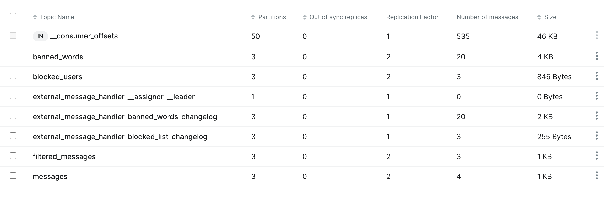

По адресу http://localhost:5000 будет доступен UI чата.

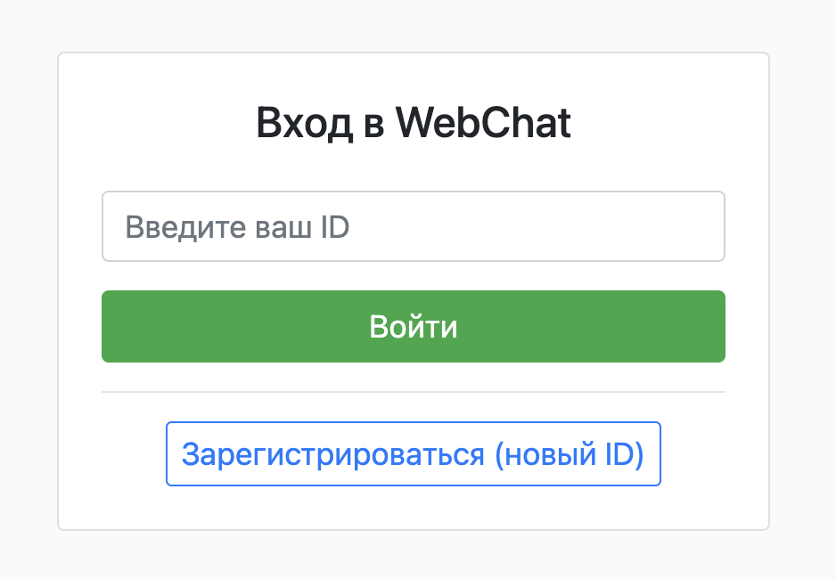

### Тестирование

Зайдем в приложение (один "пользователь" через обычный браузер, другой в режиме инкогнито).

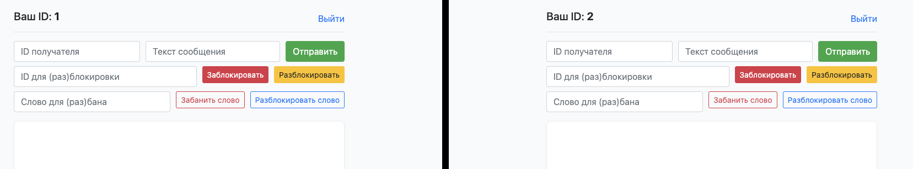

#### Обычная отправка сообщения

Попробуем отправить сообщение от пользователя 1 к пользователю 2.

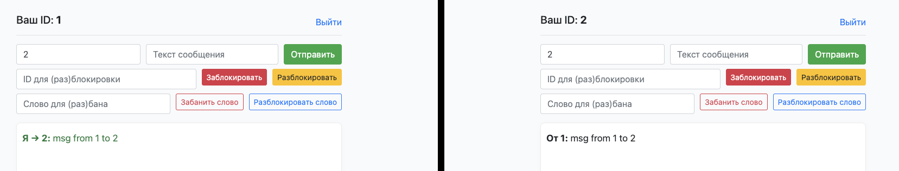

В обратную сторону

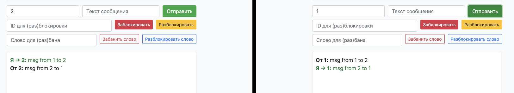

#### Блокировка и разблокировка пользователя

Пользователь 1 блокирует пользователя 2.

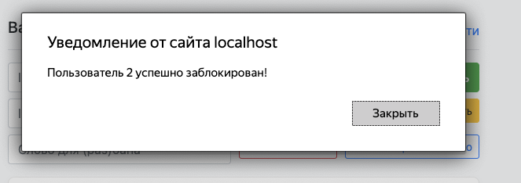

Пользователь 2 пытается отправить сообщение пользователю 1. У него не получается.

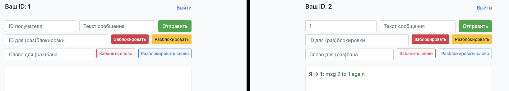

Сообщение в логах, о том, что сообщение было удалено.

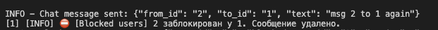

Пользователь 1 разблокировал пользователя 2.

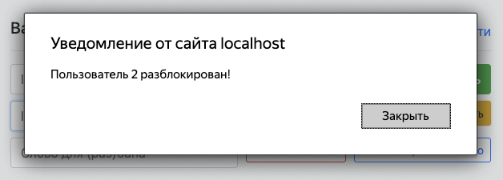

Пользователь 2 пытается отправить сообщение пользователю 1. У него получается.

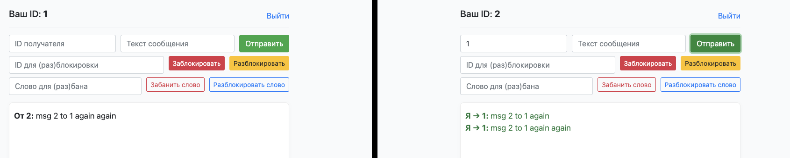

### Список цензурированных слов

Блокируем слово 'bad word'.

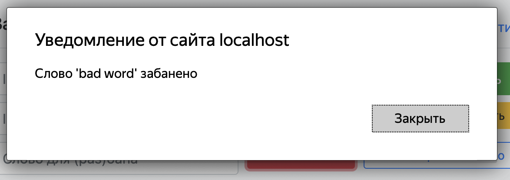

Пользователь 1 отправляет сообщение пользователю 2 с плохим словом. Слово заменяется на ***.

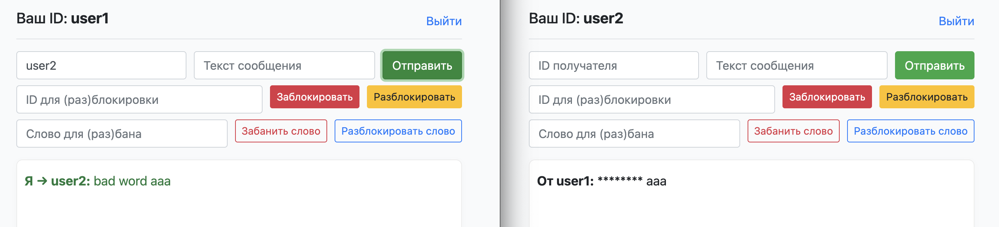

Разблокируем слово 'bad word'

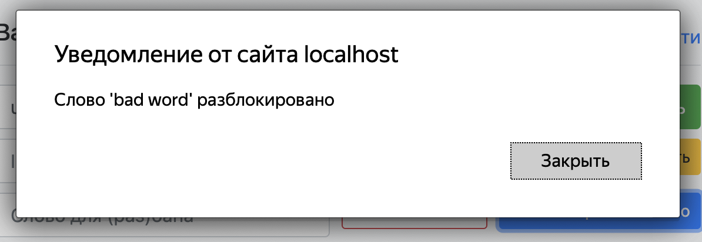

Пользователь 1 отправляет сообщение пользователю 2 с плохим словом. Слово остается как есть.

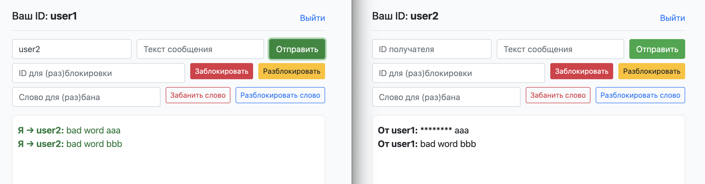
