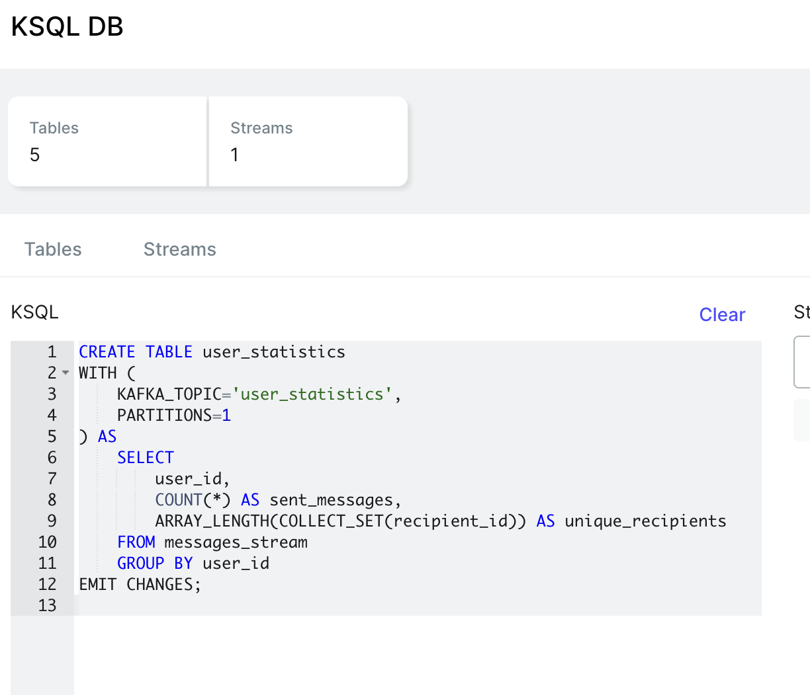
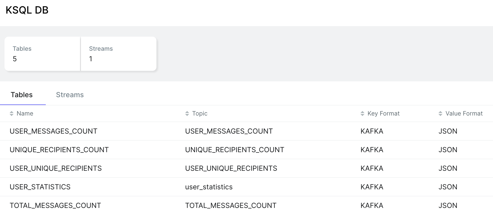
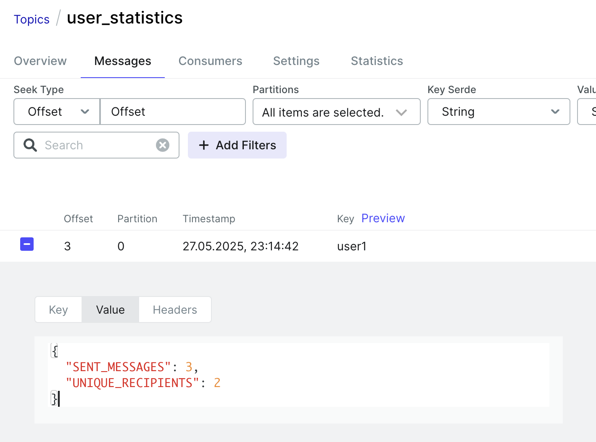

## Задание 2

**Цель**: реализовать аналитику для системы обмена сообщениями с помощью ksqlDB. Сообщения в JSON-формате содержат поля user_id, recipient_id, message и timestamp. 

**Задачи**:

1. Анализ сообщений в реальном времени
   
    - Создать поток в ksqlDB (messages_stream), который будет принимать входящие сообщения из Kafka.
    - Реализуйте таблицы, подсчитывающие: общее количество отправленных сообщений, количество уникальных получателей сообщений;

2. Сбор статистики по пользователям

    - Создайте таблицу user_statistics для агрегирования данных по каждому пользователю: сообщения, отправленные каждым пользователем, количество уникальных получателей для каждого пользователя.

### Настройка окружения

Для запуска kSQL памяти по умолчанию (2Gb) в colima не хватает, поэтому требуется перезапуск.

```bash
colima stop
colima start --cpu 4 --memory 6
colima status -e  # для проверки, что все получилось
```

### Запуск кластера

```bash
docker-compose up

docker ps
docker exec -it <container_id_kafka> /bin/sh
cd /opt/bitnami/kafka/bin

kafka-topics.sh --create --topic messages --bootstrap-server broker-0:9092 --partitions 1 --replication-factor 1
```

### Создание таблиц

Через UI запускаем скрипт ksqldb-queries



Результат



### Тестирование

В UI накидываем тестовые сообщения в топик messages

```json
{
  "user_id": "user1",
  "recipient_id": "user2",
  "message": "Hi!",
  "timestamp": 1705938000
}
{
  "user_id": "user1",
  "recipient_id": "user3",
  "message": "Hello!",
  "timestamp": 1705938001
}
{
  "user_id": "user2",
  "recipient_id": "user1",
  "message": "Hey!",
  "timestamp": 1705938002
}
{
  "user_id": "user1",
  "recipient_id": "user2",
  "message": "How are you?",
  "timestamp": 1705938003
}
```

Результат в топике user_statistics



Запросы через kSQL UI

```sql
-- Количество всех сообщений: 4
SELECT * FROM total_messages_count EMIT CHANGES;

-- Количество уникальных получателей всех сообщений: 3
SELECT * FROM unique_recipients_count EMIT CHANGES;

-- Количество сообщений, отправленных каждым пользователем
-- user2 : 1
-- user1 : 3
SELECT * FROM user_messages_count EMIT CHANGES;

-- Количество уникальных получателей для каждого пользователя
-- user2 : 1
-- user1 : 2
SELECT * FROM user_unique_recipients EMIT CHANGES;

-- Итоговая статистика по пользователям
-- USER_ID	SENT_MESSAGES  UNIQUE_RECIPIENTS
-- user2         1                1
-- user1         3                2
SELECT * FROM user_statistics EMIT CHANGES;
```
