## Лабораторная работа №4

> В этой практической работе вы будете настраивать Debezium Connector для передачи данных из базы данных PostgreSQL в Apache Kafka с использованием механизма Change Data Capture (CDC). 
Цель практической работы  — закрепить знания о работе с коннекторами, а также научиться собирать и анализировать метрики.

### Структура директорий и проекта

```
|_ Dockerfile.jmx           # Для сборки контейнера JMX Exporter (метрики для Prometheus)
|_ debezium-connector.json  # Настройки Debezium Connector для Kafka Connect
|_ docker-compose.yaml      
|_ jmx-config.yml           # Правила экспорта JMX-метрик Kafka Connect
|_ postgres-init
  |_ 01_create_tables.sql   # Создание таблиц orders и users
|_ prometheus
  |_ prometheus.yml         # Где и как Prometheus собирает метрики
|_ test_consumer.py         # Скрипт для чтения событий из Kafka
```

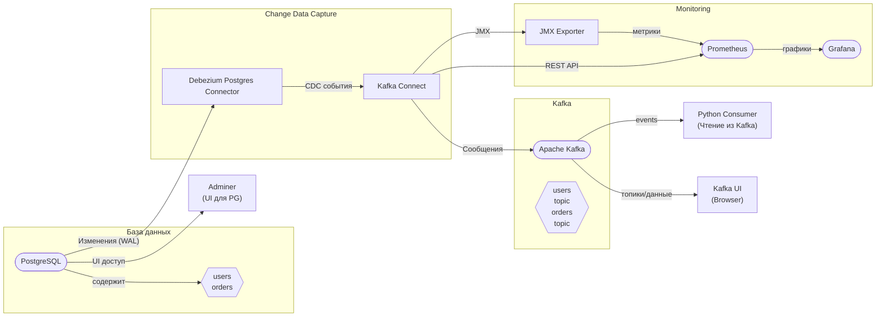

### Запуск кластера

```bash
mkdir kafka-data kafka-connect-plugins
chmod -R 777 kafka-data kafka-connect-plugins postgres-init prometheus
chmod 666 prometheus/prometheus.yml

docker-compose build kafka-connect-jmx
docker-compose up -d
```

В результате будут доступны следующие сервисы:

* Kafka Connect REST API: http://localhost:8083
* Adminer (Postgres UI): http://localhost:8082
* Kafka UI (Provectus): http://localhost:8081
* Prometheus: http://localhost:9090
* Grafana: http://localhost:3000

Через UI посгреса можем увидеть две созданные таблицы. Для подключения используем:

* Server: postgres
* Username: test_user
* Password: test_password
* Database: test_db

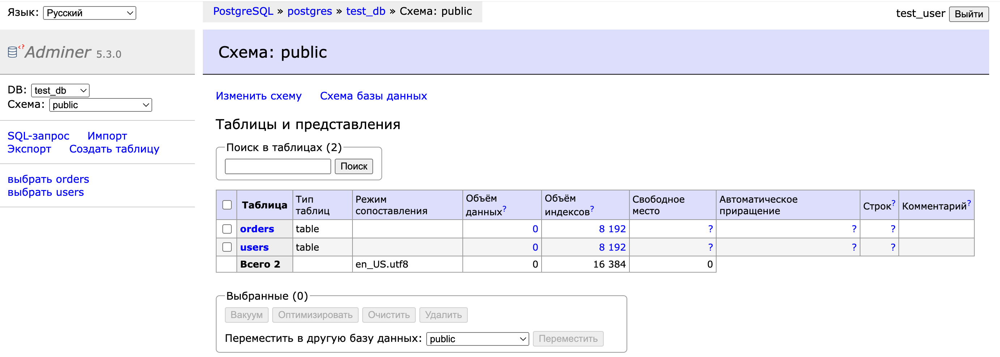

В UI кафки доступен кластер:

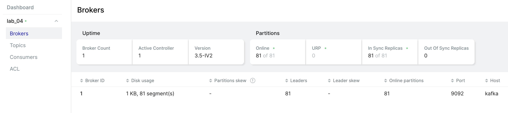

### Заполнить БД тестовыми значениями

*<необязательно, но можно для подтверждения того, что пока не настроен коннектор, postgres с кафкой никак не связаны>*

Используем скрипт для заполнения таблиц набором значений (добавляем через SQL-запрос в Adminer).

```sql
-- Добавление пользователей
INSERT INTO users (name, email) VALUES ('John Doe', 'john@example.com');
INSERT INTO users (name, email) VALUES ('Jane Smith', 'jane@example.com');
INSERT INTO users (name, email) VALUES ('Alice Johnson', 'alice@example.com');
INSERT INTO users (name, email) VALUES ('Bob Brown', 'bob@example.com');

-- Добавление заказов
INSERT INTO orders (user_id, product_name, quantity) VALUES (1, 'Product A', 2);
INSERT INTO orders (user_id, product_name, quantity) VALUES (1, 'Product B', 1);
INSERT INTO orders (user_id, product_name, quantity) VALUES (2, 'Product C', 5);
INSERT INTO orders (user_id, product_name, quantity) VALUES (3, 'Product D', 3);
INSERT INTO orders (user_id, product_name, quantity) VALUES (4, 'Product E', 4);
```

Результат:

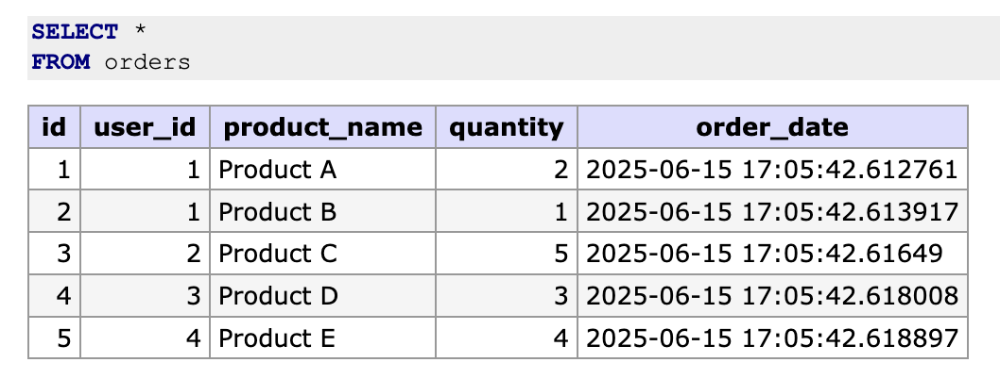

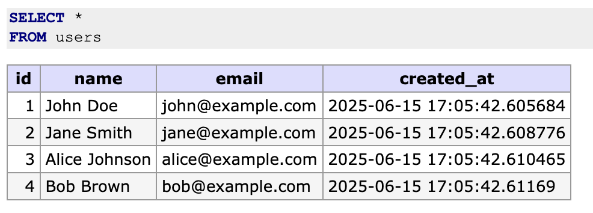

### Настройка и запуск Debezium Connector

Создаем коннектор:

```bash
curl -X POST -H "Content-Type: application/json" --data @debezium-connector.json http://localhost:8083/connectors
```

Проверяем статус:

```bash
curl http://localhost:8083/connectors/debezium-postgres-connector/status
```

Результат:

```json
{
    "name":"debezium-postgres-connector",
    "connector": {
        "state":"RUNNING",
        "worker_id":"172.19.0.8:8083"
    },
    "tasks": [
        {
            "id":0,
            "state":"RUNNING",
            "worker_id":"172.19.0.8:8083"
        }
    ],
    "type":"source"
}
```

В кафка появились два топика:

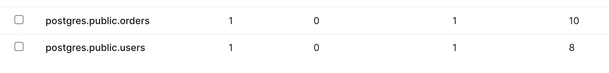

### Проверка корректности работы коннектора и кафки

Установка зависимостей:

```bash
which python3.12
<путь до python3.12> -m venv venv
source venv/bin/activate
pip install confluent-kafka
```

Запуск консьюмера:

```bash
python test_consumer.py
```

**Тестируем отправку данные в таблицу users**

SQL запрос в Admins:

```sql
INSERT INTO users (name, email) VALUES ('TEST user', 'test_user@test.com');
```

Результат в Admins:

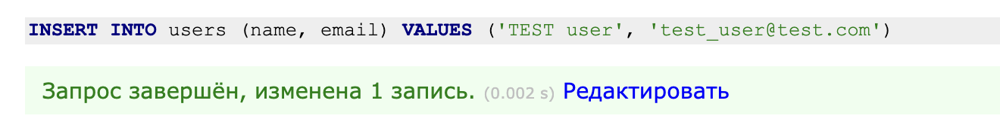

Результат в Kafka UI:

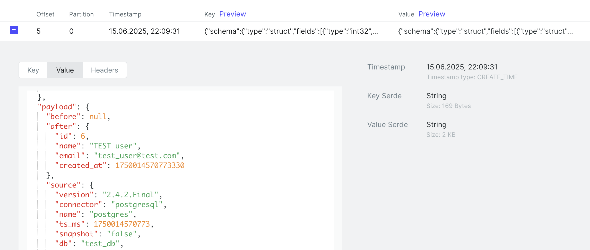

Результат в терминале:

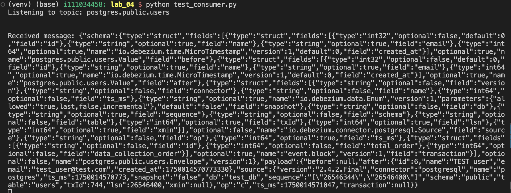


**Аналогично проверяем таблицу orders**

Заменив в test_consumers топик на `postgres.public.orders`, отправляем SQL запрос:

```sql
INSERT INTO orders (user_id, product_name, quantity) VALUES (1, 'TEST', 100);
```

Результат в терминале:

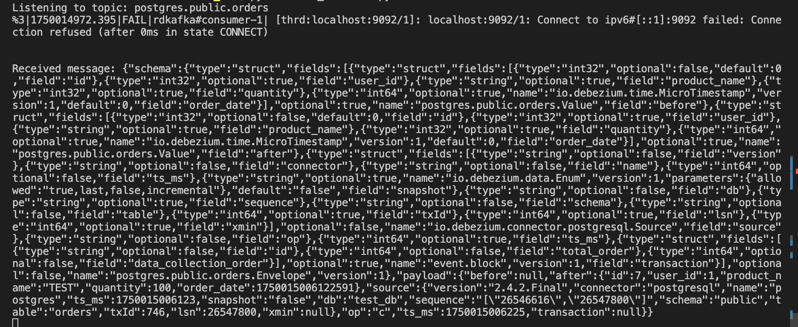


### JMX + Prometheus + Grafana

Результат преобразования JMX экспортером метрик можно увидеть на порту http://localhost:9100/metrics

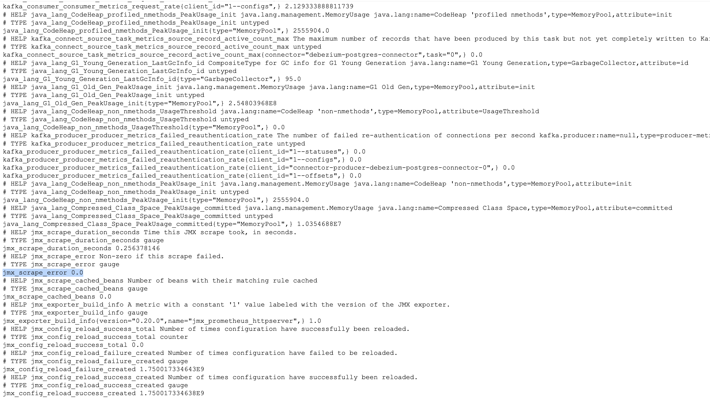

Prometheus:

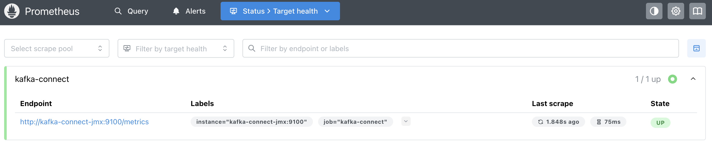

Grafana:

* Login admin
* Password admin

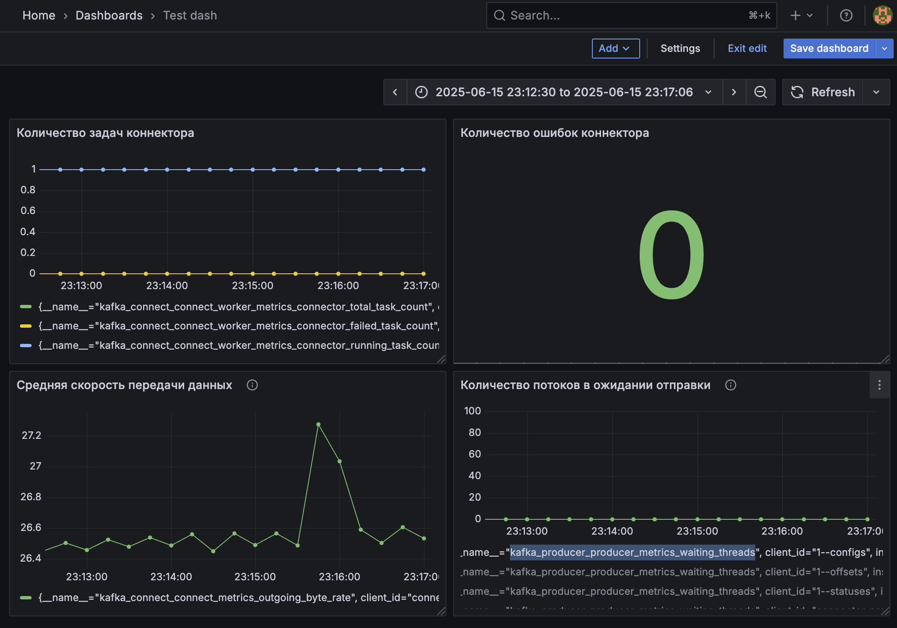

#### Пояснения к выбранным метрикам мониторинга Kafka Connect

**Connector Tasks (выполненные, упавшие и активные)**
* `kafka_connect_connect_worker_metrics_connector_total_task_count`
* `kafka_connect_connect_worker_metrics_connector_failed_task_count`
* `kafka_connect_connect_worker_metrics_connector_running_task_count`

Позволяют отслеживать текущее количество всего созданных, успешно работающих и аварийно завершённых задач коннектора. Эти показатели критичны для контроля работоспособности пайплайна: если выросло число неактивных или упавших задач, значит, есть сбой в обработке данных.

**Ошибки задач коннектора**

* `kafka_connect_task_error_metrics_total_errors_logged`

Отражает общее число ошибок, возникших в задачах. Рост этой метрики — сигнал о проблемах в процессе интеграции (например, при чтении/записи в базу или Kafka).

**Скорость передачи данных**

* `kafka_connect_connect_metrics_outgoing_byte_rate`

Показывает, с какой скоростью коннектор передаёт данные в Kafka. Важно для оценки загрузки системы и своевременного обнаружения перегрузок или простоев.

**Ожидающие потоки Producer**

* `kafka_producer_producer_metrics_waiting_threads`

Отражает количество потоков, ждущих возможности отправить данные в Kafka. Если этот показатель растёт — появляются задержки отдачи сообщений, что может привести к накоплению очереди и сбоям.
