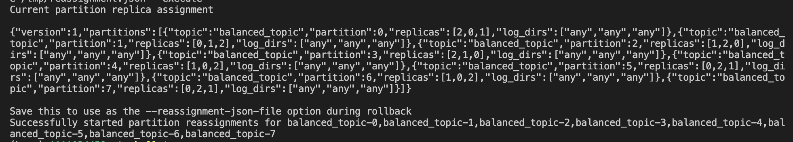
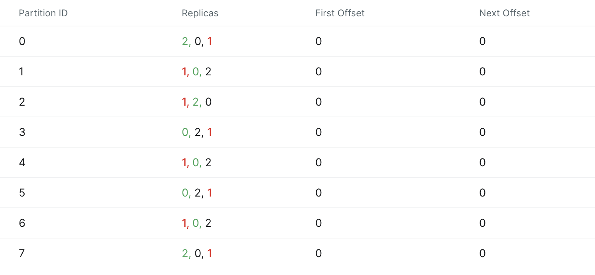

## Задание 1. Балансировка партиций и диагностика кластера

Цели задания:
  * освоить балансировку партиций и распределение нагрузки с помощью Partition Reassignment Tools
  * попрактиковаться в диагностике и устранении проблем кластера

### Запуск кластера

```bash
docker-compose up -d
```

Кластер доступен по адресу http://127.0.0.1:8086

### Создание топика

```bash
docker exec -it kafka-0 bash
kafka-topics.sh --create --topic balanced_topic --partitions 8 --replication-factor 3 --bootstrap-server kafka-0:9092
```

Проверка, что топик создан:

```bash
kafka-topics.sh --describe --topic balanced_topic --bootstrap-server kafka-0:9092

Topic: balanced_topic   TopicId: 9cBuSGLNRreHR6BZHaNFUA PartitionCount: 8       ReplicationFactor: 3    Configs: 
        Topic: balanced_topic   Partition: 0    Leader: 2       Replicas: 2,0,1 Isr: 2,0,1
        Topic: balanced_topic   Partition: 1    Leader: 0       Replicas: 0,1,2 Isr: 0,1,2
        Topic: balanced_topic   Partition: 2    Leader: 1       Replicas: 1,2,0 Isr: 1,2,0
        Topic: balanced_topic   Partition: 3    Leader: 2       Replicas: 2,1,0 Isr: 2,1,0
        Topic: balanced_topic   Partition: 4    Leader: 1       Replicas: 1,0,2 Isr: 1,0,2
        Topic: balanced_topic   Partition: 5    Leader: 0       Replicas: 0,2,1 Isr: 0,2,1
        Topic: balanced_topic   Partition: 6    Leader: 1       Replicas: 1,0,2 Isr: 1,0,2
        Topic: balanced_topic   Partition: 7    Leader: 0       Replicas: 0,2,1 Isr: 0,2,1
```

### Определение текущего распределения партиций

```bash
kafka-topics.sh --describe --topic balanced_topic --bootstrap-server kafka-0:9092
```

Результат в главе выше. Краткий вывод:

* Партиций — 8.
* Фактор репликации — 3: каждая партиция размещается на всех 3 брокерах кластера (0, 1, 2) в различных комбинациях.
* Распределение лидеров:
  * Партиции 0 и 3 — их лидером выступает брокер 2.
  * Партиции 1, 5, 7 — лидером является брокер 0.
  * Партиции 2, 4, 6 — лидером выступает брокер 1.
* Реплики партиций равномерно разнесены между брокерами.
* Isr всегда совпадает со списком реплик: все брокеры онлайн, данные синхронизированы.

### Перераспределение партиций

Так как в режиме KRaft нельзя сгенерировать файл reassignment.json автоматически, сделаем это вручную.

В таблице ниже показано, какие изменения были внесены в распределение реплик партиций. Для нескольких партиций был изменён порядок расположения брокеров в массиве replicas. Это влияет на назначение лидера партиции, поскольку первый в списке становится лидером после применения reassignment. Таким образом осуществляется перераспределение нагрузки между брокерами без изменения общего числа реплик.

| Партиция | Было | Стало |
| -------- | ---- | ----- | 
| 1 | 0,1,2 | 1,0,2 |
| 3 | 2,1,0	| 0,2,1 |
| 7	| 0,2,1	| 2,0,1 |

Копируем файл в контейнер:

```bash
docker cp reassignment.json kafka-0:/tmp/reassignment.json
```

Применяем reassignment:

```bash
docker exec -it kafka-0 kafka-reassign-partitions.sh --bootstrap-server kafka-0:9092 --reassignment-json-file /tmp/reassignment.json --execute
```

Результат выполнения команды:



Проверим статус перераспределения:

```bash
kafka-reassign-partitions.sh --bootstrap-server kafka-0:9092 --reassignment-json-file /tmp/reassignment.json --verify

Status of partition reassignment:
Reassignment of partition balanced_topic-0 is completed.
Reassignment of partition balanced_topic-1 is completed.
Reassignment of partition balanced_topic-2 is completed.
Reassignment of partition balanced_topic-3 is completed.
Reassignment of partition balanced_topic-4 is completed.
Reassignment of partition balanced_topic-5 is completed.
Reassignment of partition balanced_topic-6 is completed.
Reassignment of partition balanced_topic-7 is completed.

Clearing broker-level throttles on brokers 0,1,2
Clearing topic-level throttles on topic balanced_topic
```

Партиции ожидаемо перераспределились:

```bash
kafka-topics.sh --describe --topic balanced_topic --bootstrap-server kafka-0:9092

Topic: balanced_topic   TopicId: 9cBuSGLNRreHR6BZHaNFUA PartitionCount: 8       ReplicationFactor: 3    Configs: 
        Topic: balanced_topic   Partition: 0    Leader: 2       Replicas: 2,0,1 Isr: 2,0,1
        Topic: balanced_topic   Partition: 1    Leader: 0       Replicas: 1,0,2 Isr: 0,1,2  <-- Было 0,1,2
        Topic: balanced_topic   Partition: 2    Leader: 1       Replicas: 1,2,0 Isr: 1,2,0
        Topic: balanced_topic   Partition: 3    Leader: 2       Replicas: 0,2,1 Isr: 2,1,0  <-- Было 2,1,0
        Topic: balanced_topic   Partition: 4    Leader: 1       Replicas: 1,0,2 Isr: 1,0,2
        Topic: balanced_topic   Partition: 5    Leader: 0       Replicas: 0,2,1 Isr: 0,2,1
        Topic: balanced_topic   Partition: 6    Leader: 1       Replicas: 1,0,2 Isr: 1,0,2
        Topic: balanced_topic   Partition: 7    Leader: 0       Replicas: 2,0,1 Isr: 0,2,1  <-- Было 0,2,1
```

### Проверка работы кластера при сбое брокера

Останавливаем брокера 1:

```bash
docker stop kafka-1
```

Состояние топика после сбоя:

```bash
docker exec -it kafka-0 bash
kafka-topics.sh --describe --topic balanced_topic --bootstrap-server kafka-0:9092

Topic: balanced_topic   TopicId: 9cBuSGLNRreHR6BZHaNFUA PartitionCount: 8       ReplicationFactor: 3    Configs: 
        Topic: balanced_topic   Partition: 0    Leader: 2       Replicas: 2,0,1 Isr: 2,0
        Topic: balanced_topic   Partition: 1    Leader: 0       Replicas: 1,0,2 Isr: 0,2
        Topic: balanced_topic   Partition: 2    Leader: 2       Replicas: 1,2,0 Isr: 2,0
        Topic: balanced_topic   Partition: 3    Leader: 0       Replicas: 0,2,1 Isr: 2,0
        Topic: balanced_topic   Partition: 4    Leader: 0       Replicas: 1,0,2 Isr: 0,2
        Topic: balanced_topic   Partition: 5    Leader: 0       Replicas: 0,2,1 Isr: 0,2
        Topic: balanced_topic   Partition: 6    Leader: 0       Replicas: 1,0,2 Isr: 0,2
        Topic: balanced_topic   Partition: 7    Leader: 2       Replicas: 2,0,1 Isr: 0,2
```

После остановки брокера из списка Isr всех партиций исчезает идентификатор 1. Это значит, что ни для одной партиции kafka-1 не является больше in-sync репликой. Таким образом, партиции продолжают обслуживаться, но количество синхронизированных реплик становится меньше — 2 вместо 3, пока брокер не вернётся в строй.

Также в UI наглядно видны новые лидеры, которые были выбраны для партиций 1, 2 и тд после отключения брокера 1.



Перезапускаем брокер 1:

```bash
docker start kafka-1
```

Реплики корректно синхронизировались:

```bash
kafka-topics.sh --describe --topic balanced_topic --bootstrap-server kafka-0:9092

Topic: balanced_topic   TopicId: 9cBuSGLNRreHR6BZHaNFUA PartitionCount: 8       ReplicationFactor: 3    Configs: 
        Topic: balanced_topic   Partition: 0    Leader: 2       Replicas: 2,0,1 Isr: 2,0,1
        Topic: balanced_topic   Partition: 1    Leader: 0       Replicas: 1,0,2 Isr: 0,2,1
        Topic: balanced_topic   Partition: 2    Leader: 2       Replicas: 1,2,0 Isr: 2,0,1
        Topic: balanced_topic   Partition: 3    Leader: 0       Replicas: 0,2,1 Isr: 2,0,1
        Topic: balanced_topic   Partition: 4    Leader: 0       Replicas: 1,0,2 Isr: 0,2,1
        Topic: balanced_topic   Partition: 5    Leader: 0       Replicas: 0,2,1 Isr: 0,2,1
        Topic: balanced_topic   Partition: 6    Leader: 0       Replicas: 1,0,2 Isr: 0,2,1
        Topic: balanced_topic   Partition: 7    Leader: 2       Replicas: 2,0,1 Isr: 0,2,1
```

### Вывод


В ходе работы реализовано перераспределение партиций с помощью reassignment.json. Изменения затронули порядок реплик и распределение лидеров, что обеспечивает более равномерную нагрузку на кластер. При остановке одного из брокеров репликация и лидерство автоматически перераспределяются между доступными узлами, после восстановления брокер быстро возвращается в Isr. Механизмы балансировки и отказоустойчивости в кластере Kafka функционируют корректно.
