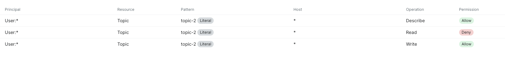
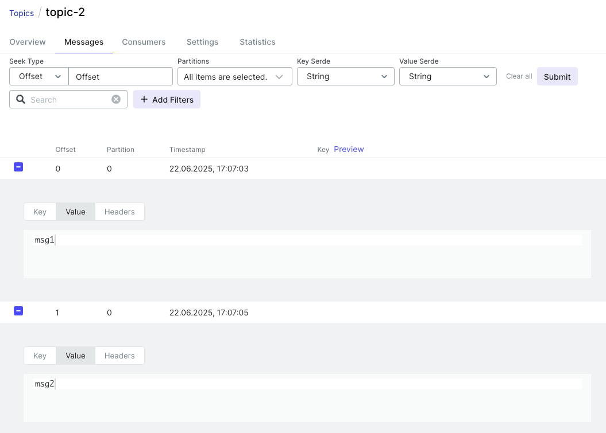

## Задание 2. Настройка защищённого соединения и управление доступом

Цель задания — настроить защищённое SSL-соединение для кластера Apache Kafka из трёх брокеров с использованием Docker Compose, создать новый топик и протестировать отправку и получение зашифрованных сообщений.

### Запуск кластера

```bash
docker-compose up -d
```

Кластер доступен по адресу http://localhost:8080.

### Генерация сертификатов и SSL-хранилищ

Создание CA (Certificate Authority):

```bash
cd ssl/ca

# Cоздать приватный ключ CA
openssl genrsa -out ca.key 4096

# Cоздать самоподписанный сертификат CA
openssl req -new -x509 -key ca.key -out ca.crt -days 3650 -subj "/CN=MyKafkaCA"
```

Создание для каждого брокера приватного ключа, CSR и подписание сертификатов:

```bash
cd ssl/broker1

# Ключ
openssl genrsa -out broker1.key 2048

# CSR
openssl req -new -key broker1.key -out broker1.csr -subj "/CN=broker1"

cd ..

# Подписать сертификат CA
openssl x509 -req -in broker1/broker1.csr -CA ca/ca.crt -CAkey ca/ca.key -CAcreateserial -out broker1/broker1.crt -days 365 -sha256

# Cделать PKCS12 Keystore
openssl pkcs12 -export \
  -in broker/broker1.crt \
  -inkey broker1/broker1.key \
  -chain -CAfile ca/ca.crt \
  -name broker1 \
  -out broker1/broker1.keystore.p12 \
  -password pass:changeit

# Импортировать корневой сертификат CA в truststore
keytool -import -noprompt \
  -alias ca \
  -file ca/ca.crt \
  -keystore broker1/broker1.truststore.p12 \
  -storetype PKCS12 \
  -storepass changeit

# Проверить commonName (CN) в сертификатах
openssl x509 -in ssl/broker1/broker1.crt -text -noout | grep Subject:
```

Аналогично для двух других брокеров и ui. Итог:

```
ssl/
├── ca/                           # Каталог с корневым центром сертификации (CA)
│   ├── ca.crt                    # Корневой сертификат CA (публичный) — используется для проверки подлинности других сертификатов, импортируется в truststore всех брокеров
│   └── ca.key                    # Приватный ключ CA — используется только для подписи сертификатов брокеров, ДОЛЖЕН храниться в секрете!
│
├── broker1/                      # Каталог с файлами для первого брокера
│   ├── broker1.crt               # Сертификат первого брокера, подписанный CA — используется для идентификации брокера при SSL-соединении
│   ├── broker1.csr               # Запрос на сертификат (Certificate Signing Request) — технический промежуточный файл, не нужен для работы брокера
│   ├── broker1.key               # Приватный ключ первого брокера — используется для дешифрования входящих сообщений, хранить в секрете!
│   ├── broker1.keystore.p12      # Keystore PKCS12 для broker1 — содержит приватный ключ + сертификат broker1, используется Kafka для SSL
│   └── broker1.truststore.p12    # Truststore PKCS12 для broker1 — содержит сертификат CA, используется для доверия к другим сертификатам
│
├── broker2/                      # Каталог с файлами для второго брокера
│   ├── broker2.crt
│   ├── broker2.csr
│   ├── broker2.key
│   ├── broker2.keystore.p12
│   └── broker2.truststore.p12
│
└── broker3/                      # Каталог с файлами для третьего брокера
    ├── broker3.crt
    ├── broker3.csr
    ├── broker3.key
    ├── broker3.keystore.p12
    └── broker3.truststore.p12
│
└── ui/                      # Каталог с файлами для ui
    ├── ui.crt
    ├── ui.csr
    ├── ui.key
    ├── ui.keystore.p12
    └── ui.truststore.p12
```

Логика взаимодействия:

```yml
                                                 ┌────────────────────┐
                                                 │      CA (Root)     │
                                                 │  (Паспортный стол) │
                                                 └────────────────────┘
                                                       ▲     ▲     ▲
                         подписывает сертификаты       │     │     │
                                                       │     │     │
                                               ┌───────┘     │     └────────┐
                                               │             │              │
    ┌────────────────────┐        ┌────────────────────┐        ┌────────────────────┐
    │   Broker1          │        │   Broker2          │        │   Broker3          │
    │ [keystore:         │        │ [keystore:         │        │ [keystore:         │
    │   свой ключ +      │        │   свой ключ +      │        │   свой ключ +      │
    │   свой сертификат] │        │   свой сертификат] │        │   свой сертификат] │
    │ [truststore:       │        │ [truststore:       │        │ [truststore:       │
    │   CA.crt]          │        │   CA.crt]          │        │   CA.crt]          │
    └────────────────────┘        └────────────────────┘        └────────────────────┘
             ▲                              ▲                               ▲
             └───────── Обмениваются сертификатами по SSL  ────────────────┘

           Каждый брокер доверяет только тем, чей сертификат подписан тем же CA

```

### Подключение SSL в конфигурацию Kafka-брокеров

В docker-compose для брокеров и UI добавляем переменные окружения для полной поддержки TLS (SSL), а также volumes для клиентского keystore и truststore.

Брокер:

```yml
environment:
  ...
  KAFKA_ADVERTISED_LISTENERS: SSL://broker1:9092
  KAFKA_INTER_BROKER_LISTENER_NAME: SSL

  KAFKA_SSL_KEYSTORE_FILENAME: broker1.keystore.p12
  KAFKA_SSL_KEYSTORE_CREDENTIALS: broker1_keystore_creds
  KAFKA_SSL_KEY_CREDENTIALS: broker1_key_creds
  KAFKA_SSL_KEYSTORE_TYPE: PKCS12

  KAFKA_SSL_TRUSTSTORE_FILENAME: broker1.truststore.p12
  KAFKA_SSL_TRUSTSTORE_CREDENTIALS: broker1_truststore_creds
  KAFKA_SSL_TRUSTSTORE_TYPE: PKCS12

  KAFKA_SSL_CLIENT_AUTH: required
volumes:
  - ./ssl/broker1/:/etc/kafka/secrets/
```

UI:

```yml
environment:
  ...
  KAFKA_CLUSTERS_0_PROPERTIES_SECURITY_PROTOCOL: SSL
  KAFKA_CLUSTERS_0_PROPERTIES_SSL_ENDPOINT_IDENTIFICATION_ALGORITHM: ""
  KAFKA_CLUSTERS_0_PROPERTIES_SSL_TRUSTSTORE_TYPE: PKCS12
  KAFKA_CLUSTERS_0_PROPERTIES_SSL_TRUSTSTORE_LOCATION: /etc/kafka-ui/ui.truststore.p12
  KAFKA_CLUSTERS_0_PROPERTIES_SSL_TRUSTSTORE_PASSWORD: changeit
  KAFKA_CLUSTERS_0_PROPERTIES_SSL_KEYSTORE_TYPE: PKCS12
  KAFKA_CLUSTERS_0_PROPERTIES_SSL_KEYSTORE_LOCATION: /etc/kafka-ui/ui.keystore.p12
  KAFKA_CLUSTERS_0_PROPERTIES_SSL_KEYSTORE_PASSWORD: changeit
  KAFKA_CLUSTERS_0_PROPERTIES_SSL_KEY_PASSWORD: changeit

  KAFKA_UI_JAVA_OPTS: -Xmx2g
volumes:
  - ./ssl/ui/ui.keystore.p12:/etc/kafka-ui/ui.keystore.p12
  - ./ssl/ui/ui.truststore.p12:/etc/kafka-ui/ui.truststore.p12
```

Кластер успешно поднят


### Создание топиков

Для создания топиков созданы файлы client-ssl.properties, которые содержат пути до реальных keystore/truststore внутри контейнера.

```bash
# topic-1 — для чтения и записи (consumer, producer)
docker exec -it task_02-broker1-1 kafka-topics --bootstrap-server broker1:9092 \
  --command-config /etc/kafka/secrets/client-ssl.properties \
  --create --topic topic-1 --partitions 1 --replication-factor 3

# topic-2 — только producer
docker exec -it task_02-broker1-1 \
  kafka-topics --bootstrap-server broker1:9092 \
  --command-config /etc/kafka/secrets/client-ssl.properties \
  --create --topic topic-2 --partitions 1 --replication-factor 3
```

### Настройка ACL

Всем брокерам в docker-compose дописываем настройку ACL:

```yml
KAFKA_AUTHORIZER_CLASS_NAME: kafka.security.authorizer.AclAuthorizer
KAFKA_ALLOW_EVERYONE_IF_NO_ACL_FOUND: 'false'
KAFKA_SUPER_USERS: User:CN=broker1;User:CN=broker2;User:CN=broker3;User:CN=kafka-ui
```

Разрешаем всем писать в topic-2:

```bash
docker exec -it task_02-broker1-1 \
  kafka-acls --bootstrap-server broker1:9092 \
  --command-config /etc/kafka/secrets/client-ssl.properties \
  --add \
  --allow-principal "User:*" \
  --operation WRITE \
  --operation DESCRIBE \
  --topic topic-2
```

Запрещаем всем читать из topic-2:

```bash
docker exec -it task_02-broker1-1 \
  kafka-acls --bootstrap-server broker1:9092 \
  --command-config /etc/kafka/secrets/client-ssl.properties \
  --add \
  --deny-principal "User:*" \
  --operation READ \
  --topic topic-2
```

Проверить результат:

```bash
docker exec -it task_02-broker1-1 \
  kafka-acls --bootstrap-server broker1:9092 \
  --command-config /etc/kafka/secrets/client-ssl.properties \
  --list \
  --topic topic-2

Current ACLs for resource `ResourcePattern(resourceType=TOPIC, name=topic-2, patternType=LITERAL)`: 
        (principal=User:*, host=*, operation=DESCRIBE, permissionType=ALLOW)
        (principal=User:*, host=*, operation=READ, permissionType=DENY)
        (principal=User:*, host=*, operation=WRITE, permissionType=ALLOW) 
```

Результат в UI:



Для корректной работы также разрешим консьюмерам присоединяться к группам:

```bash
docker exec -it task_02-broker1-1 \
  kafka-acls --bootstrap-server broker1:9092 \
  --command-config /etc/kafka/secrets/client-ssl.properties \
  --add \
  --allow-principal "User:*" \
  --operation READ \
  --group "*"
```

### Настройка продьюмера и консьюмера

Тестовые сертификаты для продюсера:

```bash
mkdir -p ssl/producer
cd ssl/producer

openssl genrsa -out producer.key 2048

openssl req -new -key producer.key -out producer.csr \
  -subj "/CN=producer-client/OU=Clients/O=Company/L=City/ST=State/C=US"

openssl x509 -req -CA ../ca/ca.crt -CAkey ../ca/ca.key \
  -in producer.csr -out producer.crt \
  -days 365 -CAcreateserial

openssl pkcs12 -export -in producer.crt \
  -inkey producer.key -out producer.keystore.p12 \
  -name producer -password pass:changeit

keytool -import -file ../ca/ca.crt \
  -alias ca -keystore producer.truststore.p12 \
  -storepass changeit -noprompt -storetype PKCS12

cat > producer.properties << EOF
security.protocol=SSL
ssl.truststore.location=/etc/kafka/producer/producer.truststore.p12
ssl.truststore.password=changeit
ssl.truststore.type=PKCS12
ssl.keystore.location=/etc/kafka/producer/producer.keystore.p12
ssl.keystore.password=changeit
ssl.keystore.type=PKCS12
ssl.key.password=changeit
EOF

echo "changeit" > producer_keystore_creds
echo "changeit" > producer_truststore_creds
echo "changeit" > producer_key_creds
```

Для консьюмера:

```bash
mkdir -p ssl/consumer
cd ssl/consumer

openssl genrsa -out consumer.key 2048

openssl req -new -key consumer.key -out consumer.csr \
  -subj "/CN=consumer-client/OU=Clients/O=Company/L=City/ST=State/C=US"

openssl x509 -req -CA ../ca/ca.crt -CAkey ../ca/ca.key \
  -in consumer.csr -out consumer.crt \
  -days 365 -CAcreateserial

openssl pkcs12 -export -in consumer.crt \
  -inkey consumer.key -out consumer.keystore.p12 \
  -name consumer -password pass:changeit

keytool -import -file ../ca/ca.crt \
  -alias ca -keystore consumer.truststore.p12 \
  -storepass changeit -noprompt -storetype PKCS12

cat > consumer.properties << EOF
security.protocol=SSL
ssl.truststore.location=/etc/kafka/consumer/consumer.truststore.p12
ssl.truststore.password=changeit
ssl.truststore.type=PKCS12
ssl.keystore.location=/etc/kafka/consumer/consumer.keystore.p12
ssl.keystore.password=changeit
ssl.keystore.type=PKCS12
ssl.key.password=changeit
EOF

echo "changeit" > consumer_keystore_creds
echo "changeit" > consumer_truststore_creds
echo "changeit" > consumer_key_creds
```

Проверка сертификатов:

```bash
openssl x509 -in ssl/producer/producer.crt -text -noout | grep "Subject:"
> Subject: CN=producer-client, OU=Clients, O=Company, L=City, ST=State, C=US

openssl x509 -in ssl/consumer/consumer.crt -text -noout | grep "Subject:"
> Subject: CN=consumer-client, OU=Clients, O=Company, L=City, ST=State, C=US
```

Обновление docker-compose:

```yml
broker1:
    image: confluentinc/cp-kafka:7.4.0
    depends_on:
      - zookeeper
    environment:
      # ...
    volumes:
      - ./ssl/broker1/:/etc/kafka/secrets/
      - ./ssl/producer/:/etc/kafka/producer/    # Новая строка
      - ./ssl/consumer/:/etc/kafka/consumer/    # Новая строка
    ports:
      - "9092:9092"
```

Перезапуск broker1:

```bash
docker-compose restart broker1
```

Тест продюсера:

```bash
docker exec -it task_02-broker1-1 \
  kafka-console-producer --bootstrap-server broker1:9092 \
  --producer.config /etc/kafka/secrets/client-ssl.properties \
  --topic topic-2

> msg 1
> msg 2
```

Сообщения успешно отправлены:



Тест консьюмера:

```bash
docker exec -it task_02-broker1-1 \
  kafka-console-consumer --bootstrap-server broker1:9092 \
  --consumer.config /etc/kafka/consumer/consumer.properties \
  --topic topic-2 \
  --from-beginning

[2025-06-22 14:15:39,495] ERROR Error processing message, terminating consumer process:  (kafka.tools.ConsoleConsumer$)
org.apache.kafka.common.errors.TopicAuthorizationException: Not authorized to access topics: [topic-2]
Processed a total of 0 messages
```

Прочитать сообщения не получилось, ACL работают правильно:

* ✅ Консьюмер смог подключиться к Kafka
* ✅ Консьюмер смог присоединиться к consumer группе (благодаря разрешению на группу)
* ✅ Консьюмер смог получить метаданные о топике
* ❌ Когда консьюмер попытался фактически прочитать данные из партиции - получил отказ

### Настройка и тестирование топика 1 (доступен для чтения и записи)

Разрешить всем пользователям все операции с топиком:

```bash
docker exec -it task_02-broker1-1 \
  kafka-acls --bootstrap-server broker1:9092 \
  --command-config /etc/kafka/secrets/client-ssl.properties \
  --add \
  --allow-principal "User:*" \
  --operation ALL \
  --topic topic-1
```

Проверить ACL:

```bash
docker exec -it task_02-broker1-1 \
  kafka-acls --bootstrap-server broker1:9092 \
  --command-config /etc/kafka/secrets/client-ssl.properties \
  --list \
  --topic topic-1

Current ACLs for resource `ResourcePattern(resourceType=TOPIC, name=topic-1, patternType=LITERAL)`: 
        (principal=User:*, host=*, operation=ALL, permissionType=ALLOW) 
```

Тест продьюсера:

```bash
docker exec -it task_02-broker1-1 \
  kafka-console-producer --bootstrap-server broker1:9092 \
  --producer.config /etc/kafka/producer/producer.properties \
  --topic topic-1

>msg1
>msg2
```

Тест консьюмера:

```bash
docker exec -it task_02-broker1-1 \
  kafka-console-consumer --bootstrap-server broker1:9092 \
  --consumer.config /etc/kafka/consumer/consumer.properties \
  --topic topic-1 \
  --from-beginning

msg1
msg2
```

### Вывод

В ходе выполнения задания был развернут кластер Apache Kafka, состоящий из трех брокеров, с использованием Docker Compose. На каждом брокере было настроено защищенное SSL-соединение — сгенерированы необходимые сертификаты, созданы и настроены truststore и keystore. Конфигурации брокеров были обновлены с учетом SSL-настроек, и успешная связь между ними подтверждена.

Были созданы два топика: topic-1 и topic-2. С помощью механизма ACL выполнена настройка прав доступа: для topic-1 разрешены операции записи и чтения как для продюсеров, так и для консьюмеров; для topic-2 доступ открыт только для продюсеров — консьюмерам чтение из этого топика запрещено. Тестовая отправка и получение сообщений через зашифрованное SSL-соединение прошла успешно, что подтверждает работоспособность и безопасность кластера согласно заданным требованиям.

### P.S.

Удалить все ACL для топика

```bash
docker exec -it task_02-broker1-1 \
  kafka-acls --bootstrap-server broker1:9092 \
  --command-config /etc/kafka/secrets/client-ssl.properties \
  --remove \
  --topic topic-2 \
  --force
```
