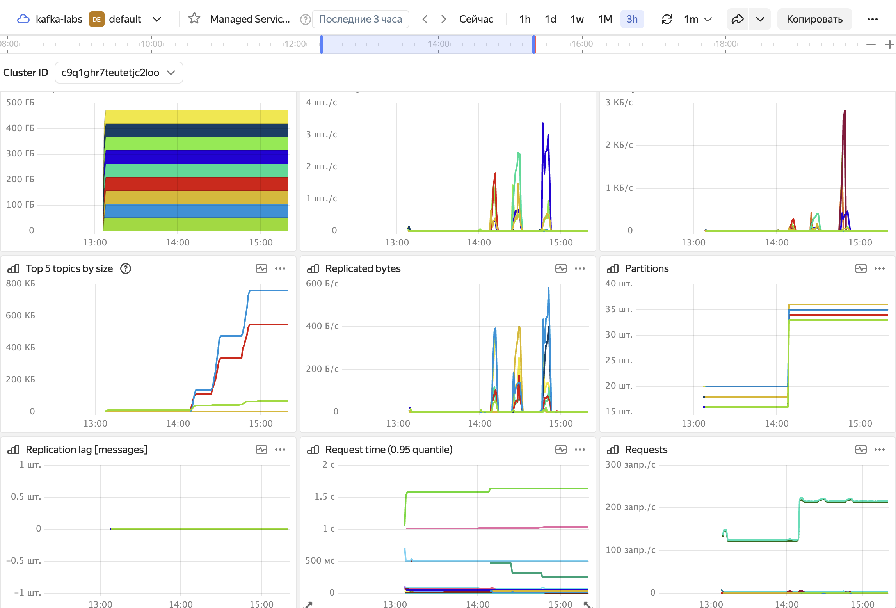

## Лабораторная работа №6

### Настройка yc

```bash
yc init
```

В процессе настройки:

* получен OAuth-токен
* выбрано облако kafka-labs
* выбрана папка default для работы
* выбрана зона доступности по умолчанию

Проверка текущего профиля:

```bash
yc config profile list
# default ACTIVE
```

Просмотр текущей конфигурации:

```bash
yc config profile get default  # или yc config list
# token: 
# cloud-id: b1gcclgmdmat2oetdkp5
# folder-id: b1gagkrsccsvs4r6rbi8
```

### Создание Kafka-кластера

Проверка доступных сетей:

```bash
yc vpc network list

+----------------------+---------+
|          ID          |  NAME   |
+----------------------+---------+
| enp4o3oc8elhip5khvnt | default |
+----------------------+---------+
```

Проверка доступных подсетей:

```bash
yc vpc subnet list

+----------------------+-----------------------+----------------------+----------------+---------------+-----------------+
|          ID          |         NAME          |      NETWORK ID      | ROUTE TABLE ID |     ZONE      |      RANGE      |
+----------------------+-----------------------+----------------------+----------------+---------------+-----------------+
| e2lv9n2c9sf62c34rdqa | default-ru-central1-b | enp4o3oc8elhip5khvnt |                | ru-central1-b | [10.129.0.0/24] |
| e9bfdf4ovutlv6op9rbf | default-ru-central1-a | enp4o3oc8elhip5khvnt |                | ru-central1-a | [10.128.0.0/24] |
| fl8aogqlmm08ejs8hi8q | default-ru-central1-d | enp4o3oc8elhip5khvnt |                | ru-central1-d | [10.130.0.0/24] |
+----------------------+-----------------------+----------------------+----------------+---------------+-----------------+
```

Создание кластера:

```bash
yc managed-kafka cluster create \
  --name production-kafka-cluster \
  --environment production \
  --network-name default \
  --brokers-count 3 \
  --version 3.5 \
  --resource-preset s2.small \
  --disk-size 50 \
  --disk-type network-ssd \
  --zone-ids ru-central1-a,ru-central1-b,ru-central1-d \
  --assign-public-ip
```

Результат:

```
done (10m24s)
id: c9q1ghr7teutetjc2loo
folder_id: b1gagkrsccsvs4r6rbi8
created_at: "2025-06-27T15:24:38.835524Z"
name: production-kafka-cluster
environment: PRODUCTION
network_id: enp4o3oc8elhip5khvnt
status: RUNNING
maintenance_window:
  anytime: {}
```


### Обоснование аппаратной конфигурации кластера

**Количество брокеров: 3**

- Минимальное количество для отказоустойчивости
- Позволяет выдержать отказ 1 брокера без потери данных
- Распределение по 3 зонам доступности

**Ресурсы брокеров: s2.medium (4 vCPU, 16 GB RAM)**

- CPU: 4 ядра обеспечивают:
  - Обработку сетевых запросов (1-2 ядра)
  - Репликацию данных (1 ядро)
  - Сжатие/декомпрессию (1 ядро)

- RAM: 16 GB распределяется:
  - JVM Heap: 6 GB
  - Page Cache: 8-9 GB
  - OS и прочее: 1-2 GB

**Диски: 100 GB SSD на брокер**

- Тип SSD выбран для:
  - Низкой задержки (<1ms)
  - Высокого IOPS (до 10000)
  - Стабильной производительности

- Размер 100 GB рассчитан из:
  - Retention: 7 дней
  - Ожидаемая нагрузка: 10-20 MB/s
  - Replication factor: 3
  - Запас: 50%

**Распределение по зонам доступности**

- ru-central1-a: брокер 1
- ru-central1-b: брокер 2  
- ru-central1-d: брокер 3
- Обеспечивает доступность при отказе целой зоны

**Оценка производительности**

- Пропускная способность: до 100 MB/s на кластер
- Количество сообщений: до 200K msg/s (при 500 bytes/msg)
- Задержка: p99 < 10ms

Для демонстрационных целей использована конфигурация s2.small.  Для реального production-окружения рекомендуется s2.medium или выше согласно приведенным выше расчетам.

### Создание топика

Создать пользователя:

```bash
yc managed-kafka user create kafka-user \
  --cluster-name production-kafka-cluster \
  --password 123P! \
  --permission topic="*",role=ACCESS_ROLE_ADMIN
```

Результат:

```
name: kafka-user
cluster_id: c9q1ghr7teutetjc2loo
permissions:
  - topic_name: '*'
    role: ACCESS_ROLE_ADMIN
```


Создание топика:

```bash
yc managed-kafka topic create production-topic \
  --cluster-name production-kafka-cluster \
  --partitions 3 \
  --replication-factor 3 \
  --cleanup-policy delete \
  --retention-ms 604800000 \
  --segment-bytes 1073741824
```

Описание параметров:

* `cleanup-policy` - политика очистки старых данных (delete удаляет сообщения старше retention-ms)
* `retention-ms` - время хранения сообщений в миллисекундах (сообщения старше 7 дней автоматически удаляются)
* `segment-bytes` - максимальный размер одного сегмента лога в байтах (1 GB)

Результат:

```bash
yc managed-kafka topic get production-topic \
  --cluster-name production-kafka-cluster
```

```
name: production-topic
cluster_id: c9q1ghr7teutetjc2loo
partitions: "3"
replication_factor: "3"
topic_config_3:
  cleanup_policy: CLEANUP_POLICY_DELETE
  retention_ms: "604800000"
  segment_bytes: "1073741824"
```


### Получение информации для подключения

Получить список хостов:

```bash
yc managed-kafka cluster list-hosts production-kafka-cluster
```


Сохранить в переменную для дальнейшего использования:

```bash
BOOTSTRAP_SERVERS=$(yc managed-kafka cluster list-hosts production-kafka-cluster --format json | jq -r '.[].name' | paste -sd "," -)

echo "Bootstrap servers: $BOOTSTRAP_SERVERS"
```

### Настройка Kafka Cli

Из-за старой версии Mac Os устанавливаю через бинарники:

```bash
mkdir ~/kafka-cli && cd ~/kafka-cli

# Скачать Kafka
curl -O https://archive.apache.org/dist/kafka/3.5.0/kafka_2.13-3.5.0.tgz

# Распаковать
tar -xzf kafka_2.13-3.5.0.tgz
cd kafka_2.13-3.5.0

# Проверить, что Java установлена
java -version

# Скачать сертификат
curl -O https://storage.yandexcloud.net/cloud-certs/CA.pem

# Создать конфигурацию
cat > client.properties << EOF
security.protocol=SASL_SSL
sasl.mechanism=SCRAM-SHA-512
sasl.jaas.config=org.apache.kafka.common.security.scram.ScramLoginModule required username="kafka-user" password="123P!";
ssl.truststore.location=$(pwd)/CA.pem
ssl.truststore.type=PEM
ssl.endpoint.identification.algorithm=
EOF
```

### Посмотреть описание топика через kafka-topics

```bash
./bin/kafka-topics.sh --describe \
  --topic production-topic \
  --bootstrap-server $BOOTSTRAP_SERVERS \
  --command-config client.properties
```

Результат:


```
Topic: production-topic
- TopicId: q9538skXS32vT2BdCyhdUQ
- PartitionCount: 3 ✓ (как и требовалось)
- ReplicationFactor: 3 ✓ (как и требовалось)
- Configs: 
  - cleanup.policy=delete ✓
  - retention.ms=604800000 ✓ (7 дней)
  - segment.bytes=1073741824 ✓ (1 GB)
  - min.insync.replicas=2 (дополнительная настройка для надежности)

Партиции распределены по брокерам:
- Partition 0: Leader на брокере 3, реплики на 3,4,7
- Partition 1: Leader на брокере 6, реплики на 6,7,2
- Partition 2: Leader на брокере 9, реплики на 9,2,5
```

### Настройка Schema Registry

Сгенерировать SSH ключи для создания ВМ:

```bash
ssh-keygen -t rsa -b 2048 -f ~/.ssh/yc-key -N ""
```

Создание ВМ:

```bash
yc compute instance create \
  --name schema-registry-vm \
  --zone ru-central1-a \
  --network-interface subnet-name=default-ru-central1-a,nat-ip-version=ipv4 \
  --create-boot-disk image-folder-id=standard-images,image-family=ubuntu-2004-lts,size=20 \
  --memory 4 \
  --cores 2 \
  --preemptible \
  --ssh-key ~/.ssh/yc-key.pub
```


Зайти на ВМ:

```bash
ssh -i ~/.ssh/yc-key yc-user@51.250.88.179
```

Настройка:

```bash
# Установка пакетов
sudo apt update
sudo apt install -y openjdk-11-jdk wget curl

# Скачивание Confluent Platform
wget https://packages.confluent.io/archive/7.5/confluent-community-7.5.0.tar.gz
tar -xzf confluent-community-7.5.0.tar.gz
cd confluent-7.5.0

# Скачивание SSL сертификата Yandex
sudo mkdir -p /opt/kafka/ssl
sudo wget "https://storage.yandexcloud.net/cloud-certs/CA.pem" -O /opt/kafka/ssl/YandexCA.crt

# Проверить, что все скачалось
ls -la /opt/kafka/ssl/YandexCA.crt
cat /opt/kafka/ssl/YandexCA.crt

# Импортировать сертификат в Java trustore
JAVA_HOME=$(readlink -f /usr/bin/java | sed "s:bin/java::")
echo "JAVA_HOME: $JAVA_HOME"

sudo keytool -import -trustcacerts \
  -keystore $JAVA_HOME/lib/security/cacerts \
  -alias YandexCA \
  -file /opt/kafka/ssl/YandexCA.crt \
  -storepass changeit \
  -noprompt

# Создать отдельный trustore
sudo keytool -import -trustcacerts \
  -keystore /opt/kafka/ssl/kafka.truststore.jks \
  -alias YandexCA \
  -file /opt/kafka/ssl/YandexCA.crt \
  -storepass changeit \
  -noprompt

# Установить права
sudo chown yc-user:yc-user /opt/kafka/ssl/kafka.truststore.jks
```

Получить список хостов (FQDN брокеров):

```bash
yc managed-kafka cluster list-hosts production-kafka-cluster --format json | jq -r '.[].name'
```

Создание конфигурационного файла:

```bash
# Директория для конфигурации
sudo mkdir -p /etc/schema-registry

sudo tee /etc/schema-registry/schema-registry.properties << EOF
# Основные настройки
listeners=http://0.0.0.0:8081
host.name=schema-registry

# Подключение к Kafka кластеру
kafkastore.bootstrap.servers=rc1a-1dtppv0ei700ror4.mdb.yandexcloud.net:9091,rc1b-qcf9i2q5todkaqo7.mdb.yandexcloud.net:9091,rc1d-65ks63ccs7naqnmp.mdb.yandexcloud.net:9091

# Аутентификация
kafkastore.security.protocol=SASL_SSL
kafkastore.sasl.mechanism=SCRAM-SHA-512
kafkastore.sasl.jaas.config=org.apache.kafka.common.security.scram.ScramLoginModule required username="kafka-user" password="123P!";

# SSL настройки
kafkastore.ssl.truststore.location=/opt/kafka/ssl/kafka.truststore.jks
kafkastore.ssl.truststore.password=changeit
kafkastore.ssl.endpoint.identification.algorithm=

# Настройки топика для схем
kafkastore.topic=_schemas
kafkastore.topic.replication.factor=3

# Совместимость
schema.compatibility.level=backward

# Тайм-ауты
kafkastore.init.timeout.ms=60000
kafkastore.timeout.ms=30000
EOF
```

Создать systemd сервис:

```bash
sudo tee /etc/systemd/system/schema-registry.service << EOF
[Unit]
Description=Confluent Schema Registry
After=network.target

[Service]
Type=simple
User=$USER
ExecStart=$HOME/confluent-7.5.0/bin/schema-registry-start /etc/schema-registry/schema-registry.properties
Restart=on-failure
RestartSec=10

[Install]
WantedBy=multi-user.target
EOF
```

Запустить:

```bash
sudo systemctl daemon-reload
sudo systemctl restart schema-registry

# Проверить статус
sudo systemctl status schema-registry

# Посмотреть логи
sudo journalctl -u schema-registry -f
```


Проверка подключения:

```bash
curl http://localhost:8081/
{}

curl http://localhost:8081/v1/metadata/id
{
  "scope":{
    "path":[],
    "clusters":{
      "kafka-cluster":"X2kmNaXZSvu9bT6zWJYErA",
      "schema-registry-cluster":"schema-registry"
    }
  }
}

curl http://localhost:8081/config
{
  "compatibilityLevel":"BACKWARD"
}
```

### Регистрация тестовой схемы

Создать файл со схемой:

```bash
cat > user.avsc << EOF
{
  "type": "record",
  "name": "User",
  "namespace": "com.example",
  "fields": [
    {"name": "id", "type": "int"},
    {"name": "name", "type": "string"},
    {"name": "email", "type": "string"},
    {"name": "created_at", "type": "long", "logicalType": "timestamp-millis"}
  ]
}
EOF
```

Регистрация схемы:

```bash
curl -X POST -H "Content-Type: application/vnd.schemaregistry.v1+json" \
  --data '{"schema": "{\"type\":\"record\",\"name\":\"User\",\"namespace\":\"com.example\",\"fields\":[{\"name\":\"id\",\"type\":\"int\"},{\"name\":\"name\",\"type\":\"string\"},{\"name\":\"email\",\"type\":\"string\"},{\"name\":\"created_at\",\"type\":\"long\",\"logicalType\":\"timestamp-millis\"}]}"}' \
  http://localhost:8081/subjects/production-topic-value/versions
```

Проверка:

```bash
curl http://localhost:8081/subjects
curl http://localhost:8081/subjects/production-topic-value/versions/1
```


### Тестовый продьюсер и консьюмер

```bash
cd kafka-test-app
pip install confluent-kafka[avro] requests
```

Запуск в двух терминалах:

```bash
python producer.py
python consumer.py
```

Результат:


Мониторинг кластера:


### Запуск NiFi

Создание ВМ:

```bash
yc compute instance create \
  --name nifi-vm \
  --zone ru-central1-a \
  --network-interface subnet-name=default-ru-central1-a,nat-ip-version=ipv4 \
  --create-boot-disk image-folder-id=standard-images,image-family=ubuntu-2004-lts,size=30 \
  --memory 8 \
  --cores 4 \
  --preemptible \
  --ssh-key ~/.ssh/yc-key.pub

ssh -i ~/.ssh/yc-key yc-user@51.250.12.148
```


Установка NiFi:

```bash
sudo apt update
sudo apt install -y openjdk-11-jdk wget unzip

cd /opt
sudo wget https://archive.apache.org/dist/nifi/1.23.2/nifi-1.23.2-bin.zip

sudo unzip nifi-*.zip
sudo mv nifi-1.23.2 nifi
sudo chown -R $USER:$USER /opt/nifi
```

SSL сертификаты:

```bash
sudo mkdir -p /opt/kafka/ssl
sudo wget "https://storage.yandexcloud.net/cloud-certs/CA.pem" -O /opt/kafka/ssl/YandexCA.crt
sudo cp /opt/kafka/ssl/YandexCA.crt /opt/nifi/conf/

sudo keytool -import -trustcacerts \
  -keystore /opt/nifi/conf/kafka.truststore.jks \
  -alias YandexCA \
  -file /opt/kafka/ssl/YandexCA.crt \
  -storepass changeit \
  -noprompt
```

Настройка параметров:

```bash
sudo vim /opt/nifi/conf/nifi.properties
```


Создание systemd-сервиса:

```bash
sudo tee /etc/systemd/system/nifi.service << EOF
[Unit]
Description=Apache NiFi
After=network.target

[Service]
Type=forking
User=$USER
Group=$USER
ExecStart=/opt/nifi/bin/nifi.sh start
ExecStop=/opt/nifi/bin/nifi.sh stop
ExecRestart=/opt/nifi/bin/nifi.sh restart
PIDFile=/opt/nifi/run/nifi.pid
RestartSec=10
Restart=on-failure

[Install]
WantedBy=multi-user.target
EOF
```

Создать пользователя:

```bash
cd /opt/nifi
./bin/nifi.sh set-single-user-credentials admin nifiadmin123
```

Запуск NiFi:

```bash
sudo systemctl daemon-reload
sudo systemctl enable nifi

sudo systemctl stop nifi
rm -f /opt/nifi/conf/flow.xml.gz
rm -rf /opt/nifi/logs/nifi-app*.log

sudo systemctl start nifi
sudo systemctl status nifi
```

Результат:


UI: http://51.250.12.148:8080/nifi


### Настройка Nifi

#### Настройка SSL Context Service


Результат:


#### Flow для генерации данных и отправки в Kafka

File Size: `1 KB`

Custom Text: 

```bash
{
  "id": ${random():mod(10000)},
  "name": "User${random():mod(1000)}",
  "email": "user${random():mod(1000)}@example.com",
  "created_at": ${now():toNumber()}
}
```

Результат:


#### Процессор для отправки данных в Kafka

* Kafka Brokers: `rc1a-1dtppv0ei700ror4.mdb.yandexcloud.net:9091,rc1b-qcf9i2q5todkaqo7.mdb.yandexcloud.net:9091,rc1d-65ks63ccs7naqnmp.mdb.yandexcloud.net:9091`
* Topic Name: `production-topic`
* Security Protocol: `SASL_SSL`
* SASL Mechanism: `SCRAM-SHA-512`
* Username: `kafka-user`
* Password: `123P!`
* SSL Context Service: `настроенный SSL сервис`


#### Консьюмер для чтения данных из Kafka

* Kafka Brokers: `rc1a-1dtppv0ei700ror4.mdb.yandexcloud.net:9091,rc1b-qcf9i2q5todkaqo7.mdb.yandexcloud.net:9091,rc1d-65ks63ccs7naqnmp.mdb.yandexcloud.net:9091`
* Topic Name: `production-topic`
* Group ID: `nifi-consumer-group`
* Offset Reset: `earliest`
* Security Protocol: `SASL_SSL`
* SASL Mechanism: `SCRAM-SHA-512`
* Username: `kafka-user`
* Password: `123P!`
* SSL Context Service: `настроенный SSL сервис`


#### Логирование и сохранение полученных сообщений


#### Запуск всех процессоров


Проверяем output директорию, в которую процессор PutFile пишет полученные сообщения:


Проверяем один из файлов, там лежит отправленное сообщение:


#### Чтение сообщений через kafka-console-consumer

На ВМ, где находится schema registry:

```bash
./bin/kafka-console-consumer.sh  --bootstrap-server rc1a-1dtppv0ei700ror4.mdb.yandexcloud.net:9091   --topic production-topic   --consumer.config client.properties
```

Результат:


#### Кластер во время всех этих действий



### Итог

В рамках проекта развернут и настроен Kafka-кластер `production-kafka-cluster` в Yandex Cloud, состоящий из трех брокеров с настроенной репликацией и хранением данных в топике `production-topic`.

Использованы параметры хранения: `retention-ms=604800000` (7 дней) и `segment-bytes=1073741824` (1GB). Для обеспечения надежности установлена настройка `min.insync.replicas=2`. Дополнительно, развернута виртуальная машина для Schema Registry с установленной Confluent Platform.

Для проверки работы Kafka использованы команды `kafka-topics.sh`, подтверждающие корректную конфигурацию топика. Распределение партиций между брокерами также проверено.

В дальнейшем Kafka-кластер интегрирован с Apache NiFi. NiFi записывает данные в топик producer-topic с помощью продьюсера `PublishKafka`, после читает их с помощью консьюмера `ConsumeKafka` и сохраняет их в файлы внутри директории `/tmp/kafka-output`.
