# Лабораторная работа №7

## Цель проекта

Разработать отказоустойчивую и безопасную event-driven платформу на базе Apache Kafka, обеспечивающую:

1. Приём данных
    * От магазинов (через SHOP API)
    * От пользователей (через CLIENT API)
2. Безопасность и контроль доступа
    * TLS-шифрование трафика
    * ACL (только авторизованные сервисы могут писать/читать данные)
3. Схемы данных
    * Единый формат (Avro) через Schema Registry
    * Валидация сообщений на этапе отправки
4. Обработку в реальном времени (фильтрация запрещённых товаров)
5. Репликация между кластерами
6. Аналитику и мониторинг

## Быстрый старт

Запуск:

```bash
# Настройка директорий для записи данных
./setup_tmp_data.sh    
./setup_ssl.sh 

# Запуск кластеров Kafka + Schema Registry + Mirrow
docker-compose up -d    

# Настройка кластеров
./setup_topics.sh
./setup_acl.sh

# Настройка Schema Registry
./register_schemes.sh

# Подключение к кластеру системы мониторинга (Exported + Prometeus + Grafana)
docker-compose -f docker-compose-monitoring.yml up -d

# Подключение коннектора для записи данных их Kafka в БД (файл) и регистрация коннектора
docker-compose -f docker-compose-connect.yml up -d
curl -X POST -H "Content-Type: application/json" -d @./config/kafka-connect/config.json http://localhost:8083/connectors

# Подключение API + Kafka Connect для записи отфильтрованных товаров в файл
docker-compose -f docker-compose-app.yml up -d
```

После запуска будут доступны:

| Сервис   | Адрес                 |
| -------- | --------------------- |
| Kafka UI | http://localhost:8080 |
| Schema Registry | http://localhost:8081 |
| Kafka Exporter | http://localhost:9308 |
| Kafka Connect | http://localhost:8083 |
| Prometheus | http://localhost:9090 |
| Grafana | http://localhost:3000 |

Тестирование:

```bash
docker exec -it api bash

python shop_api.py --id 123
python client_api.py product --id 123   # должен успешно выдать информацию о товаре

python admin_api.py --add 234
python shop_api.py --id 234
python client_api.py product --id 234   # пустой вывод, так как товар в списке удаленных

python admin_api.py --remove 234
python shop_api.py --id 234
python client_api.py product --id 234   # должен успешно выдать информацию о товаре

python client_api.py recommend --id prod_001 --limit 3
```

## Архитектура проекта

Архитектура:


Структура директорий:

```bash
|_ api 
  |_ data               # Данные о продуктах в формате json
  |_ admin_api.py       # API для изменения списка заблокированных товаров
  |_ client_api.py      # API для получения информации о товаре + получения списка рекомендаций
  |_ shop_api.py        # API для регистрации новых товаров
|_ block_products_app   # Faust-приложение для потоковой обработки товаров (фильтрация)
|_ config               # Конфиги разных модулей проекта 
|_ ssl                  # Директория с SSL-сертификатами, генерируется автоматически
|_ tmp_data             # Директория с данными из контейнеров, генерируется автоматически

|_ docker-compose.yml   # Настройка двух кластеров + Schema Registry + Mirrow
|_ docker-compose-monitoring.yml   # Настройка мониторингов Grafana + Prometeus + Exporter
|_ docker-compose-app.yml          # Запуск API и Faust-приложения

|_ setup_topics.sh      # Настройка топиков
|_ setup_acl.sh         # Настройка ACL топиков
|_ register_schemes.sh  # Регистрация схем из config/schema_registry в Schema Registry

|_ setup_ssl.sh         # Генерация SSL сертификатов перед запуском кластеров
|_ setup_tmp_data.sh    # Настройка временных директорий с данными перед запуском
```

## Настройка кластеров

Развернуты два изолированных Kafka-кластера:

* `Prod-кластер` – основной кластер для production-нагрузки.
* `Analytics-кластер` – предназначен для аналитических задач и обработки данных.

| Компонент | Prod-кластер                               | Analytics-кластер                          |
| --------- | ------------------------------------------ | ------------------------------------------ |
| Zookeeper | порт 2181                                  | порт 2182                                  |
| Брокеры   | 3 ноды (ID: 1-3)<br>порты 9092, 9094, 9096 | 3 ноды (ID: 1-3)<br>порты 9097, 9098, 9099 |

Также были подключены:

* `MirrorMaker 2` - для репликации топиков между кластерами.
* `Kafka UI` - единый интерфейс управления для обоих кластеров. Доступен по адресу http://localhost:8080.

Команда запуска:

```bash
docker-compose up -d
```

Результат:

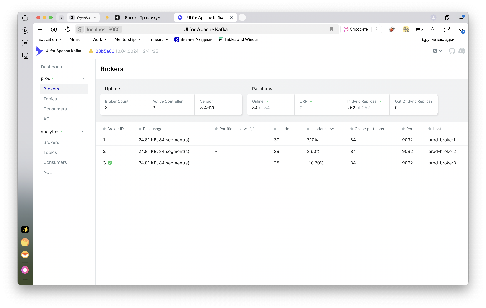

### SSL

Вся коммуникация между компонентами системы защищена сквозным SSL-шифрованием, включая передачу данных между брокерами, клиентами и сервисами. Для аутентификации используется механизм двусторонней проверки сертификатов, что гарантирует подтверждение подлинности обеих сторон соединения.

Команда генерации сертификатов для всех сервисов:

```bash
./setup_ssl.sh
```

В результате в директории ssl создаются:

1. Certificate Authority (CA)

   | Компонент | Тип файла      | Тип файла                              |
   | --------- | -------------- | -------------------------------------- |
   | ca.key    | Приватный ключ | Корневой ключ для подписи сертификатов |
   | ca.crt    | Сертификат     | Корневой сертификат для верификации    |

2. Ключи для каждого из брокеров и сервисов (заменить `broker` на название сервиса)

   | Компонент             | Тип файла        | Назначение                     |
   | :-------------------- | :--------------- | :----------------------------- |
   | broker.key            | Приватный ключ   | Идентификация брокера          |
   | broker.crt            | Сертификат       | SSL-идентификация              |
   | broker.keystore.p12   | PKCS12 хранилище | Keystore для брокера           |
   | broker.truststore.p12 | PKCS12 хранилище | Truststore с CA                |
   | client-ssl.properties | Конфигурация     | Настройки SSL для клиентов     |
   | *_creds файлы         | Учётные данные   | Пароли для хранилищ (changeit) |


Список сервисов / брокеров, для которых создаются SSL ключи:

| Категория | Кол-во | Примеры                                                      |
| :-------- | :----- | :----------------------------------------------------------- |
| Брокеры   | 6      | `prod-broker1, prod-broker2, prod-broker3`<br>`analytics-broker1, analytics-broker2, analytics-broker3` |
| Сервисы   | 9      | `kafka-ui`, ` mirrormaker2`, `schema-registry`<br>`shop_api`, `client_api`, `admin_api`, `block_products_app`<br>`kafka-exporter`, `kafka-connect` |

Для служебных задач выделены привилегированные учётные записи (super-users), включая Kafka UI и MirrorMaker которые обладают расширенными правами для администрирования системы.

### Топики

Команда создания топиков:

```bash
./setup_topics.sh
```

Скрипт создает топики в двух кластерах Kafka (prod и analytics) с SSL-аутентификацией. Каждый топик настраивается с отказоустойчивой конфигурацией:

* Partitions: 3 (для горизонтального масштабирования)
* Replication Factor: 3 (гарантирует сохранность данных при отказе нод)

Топики разделены по кластерам в соответствии с их назначением:

* Prod-кластер обрабатывает основные бизнес-процессы
* Analytics-кластер обслуживает аналитические задачи

Таблица топиков Prod-кластера:

| Топик                        | Назначение                                                   |
| :--------------------------- | :----------------------------------------------------------- |
| `products`                   | Основной топик для передачи данных о продуктах               |
| `filtered_products`          | Фильтрованные продукты после модерации (через Faust-приложение) |
| `requests_to_block_products` | Команды на блокировку продуктов                              |

Таблица топиков Analytics-кластера:

| Топик                     | Назначение                                |
| :------------------------ | :---------------------------------------- |
| `product_requests`        | Запросы пользователями данных о продуктах |
| `recommendation_requests` | Запросы к системе рекомендаций            |

Топики синхронизируются между кластерами через MirrorMaker2 (Prod -> Analytics), обеспечивая согласованность данных для аналитики.

Список топиков в обоих кластерах в UI:

* prod 

  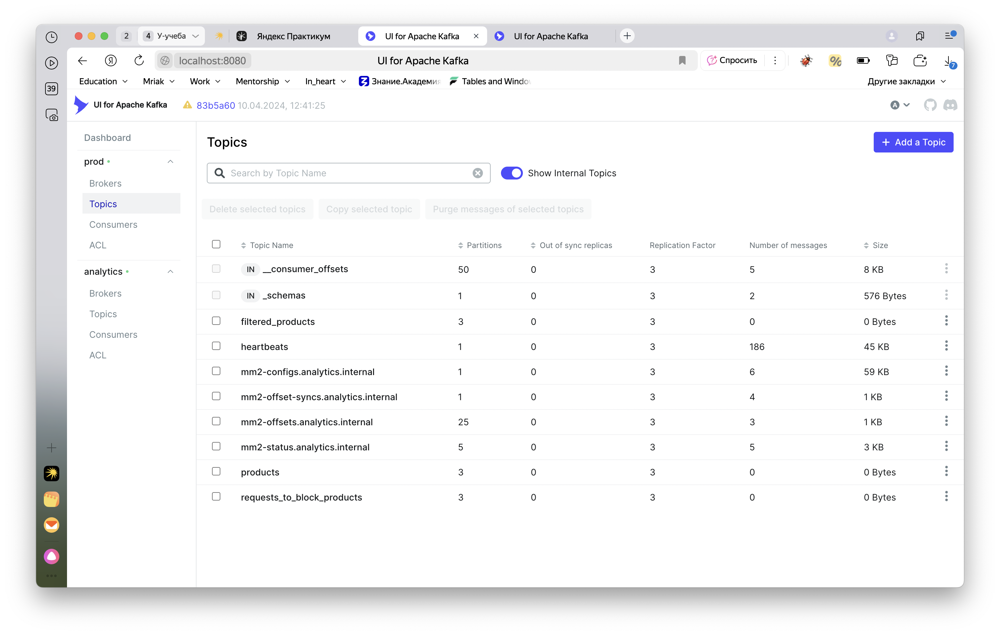

* analytics
  
  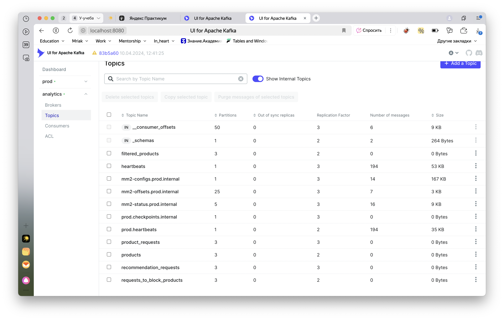

### ACL

Доступ к кластерам строго контролируется через систему ACL (Access Control Lists) с политикой "запрещено по умолчанию" — это означает, что любой запрос без явно прописанных прав будет отклонён. 

Команда настройки ACL:

```bash
./setup_acl.sh
```

Таблицы настроенных ACL:

| Сервис         | Кластер   | Топик/Группа                 | Права | Назначение                     |
| :------------- | :-------- | :--------------------------- | :---- | :----------------------------- |
| **shop_api**   | prod      | `products`                   | Write | Запись данных о продуктах      |
| **client_api** | analytics | `product_requests`           | Write | Отправка запросов аналитики    |
|                |           | `recommendation_requests`    | Write | Запросы рекомендаций           |
| **admin_api**  | prod      | `requests_to_block_products` | Write | Инициация блокировки продуктов |

| Сервис                 | Кластер | Топик/Группа                 | Права |
| :--------------------- | :------ | :--------------------------- | :---- |
| **block_products_app** | prod    | `requests_to_block_products` | Read  |
|                        |         | `products`                   | Read  |
|                        |         | `filtered_products`          | Write |
|                        |         | `*` (все топики)             | All   |
|                        |         | `*` (все consumer groups)    | All   |

| Сервис             | Кластер   | Топик/Группа        | Права                   |
| :----------------- | :-------- | :------------------ | :---------------------- |
| **mirrormaker2**   | prod      | все топики и группы | Read, Describe          |
|                    | analytics | все топики          | Write, Create, Describe |
|                    |           | все группы          | All                     |
| **kafka-exporter** | оба       | все топики и группы | Read, Describe          |
| **kafka-connect**  | prod      | все топики и группы | All                     |

Такая конфигурация ACL обеспечивает безопасный доступ к данным в соответствии с принципом минимальных привилегий.

Результат в UI:

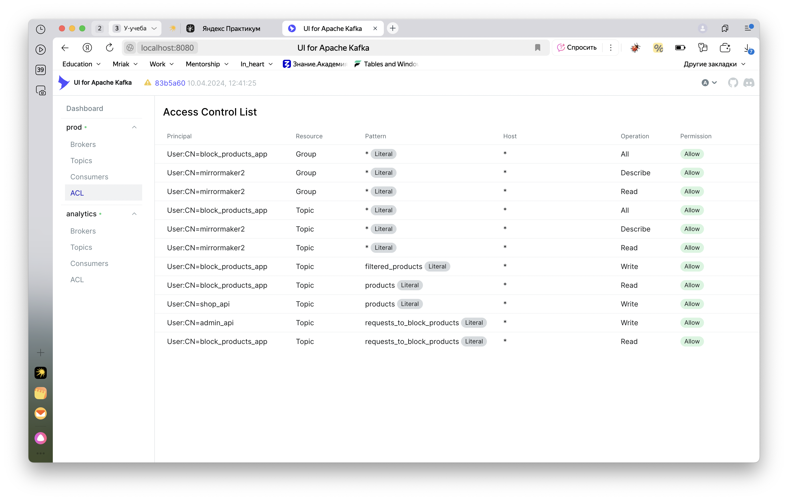

## Настройка schema registry

В системе реализован централизованный Schema Registry, развернутый как отдельный сервис в Docker-окружении. Основные характеристики:

* Порт: [8081](http://localhost:8081) (HTTP)
* Хранение схем: внутренний топик `_schemas` (replication-factor=3)
* Безопасность: подключение к Kafka через SSL

Команда регистрации схем:

```bash
./register_schemes.sh
```

Зарегистрированные схемы:

| Топик                     | Схема (AVSC)                   | Назначение                 |
| :------------------------ | :----------------------------- | :------------------------- |
| `products`                | [products.avsc]                | Схема товаров |
| `filtered_products`       | [filtered_products.avsc]       | Схема отфильрованных товаров     |
| `product_requests`        | [product_requests.avsc]        | Запросы на получение информации о товаре          |
| `recommendation_requests` | [recommendation_requests.avsc] | Запросы на получение рекомендаций    |

Проверить зарегистрированные схемы:

```bash
curl http://localhost:8081/subjects
```

Результат:

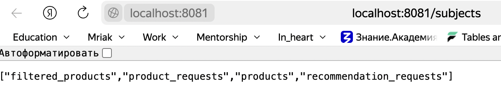

## Настройка CLI

В проекте доступно три CLI:

* `shop_api` -  для регистрации товаров
* `client_api` - для получения информации о зарегистрированных товарах, прощедших модерацию + получения рекомендаций
* `admin_api` - для блокировки и разблокировки товаров

Для ручного билда контейнера с CLI можно использовать команду `docker-compose -f docker-compose-app.yml build --no-cache`

### SHOP API

SHOP API — это сервис для добавления товаров в систему через Kafka. Он принимает данные о товарах и отправляет их в топик products prod-кластера Kafka с SSL-аутентификацией.

API использует структуру данных Product со следующими полями:

| Поле             | Тип              | Описание                          | Пример значения                        |
| :--------------- | :--------------- | :-------------------------------- | :------------------------------------- |
| `product_id`     | `str` (UUID)     | Уникальный ID товара              | `"a1b2c3d4..."`                        |
| `name`           | `str`            | Название товара                   | `"Смартфон X"`                         |
| `description`    | `str`            | Описание                          | `"Мощный смартфон с AMOLED-экраном"`   |
| `price`          | `dict`           | Цена (`amount`, `currency`)       | `{"amount": 59999, "currency": "RUB"}` |
| `category`       | `str`            | Категория                         | `"Электроника"`                        |
| `brand`          | `str`            | Бренд                             | `"Samsung"`                            |
| `stock`          | `dict`           | Остатки (`available`, `reserved`) | `{"available": 10, "reserved": 2}`     |
| `sku`            | `str`            | Артикул                           | `"SKU12345"`                           |
| `tags`           | `list[str]`      | Теги                              | `["новинка", "акция"]`                 |
| `images`         | `list[str]`      | Ссылки на изображения             | `["image1.jpg", "image2.jpg"]`         |
| `specifications` | `dict`           | Характеристики                    | `{"RAM": "8GB", "Диагональ": "6.7"}`   |
| `created_at`     | `str` (ISO-дата) | Дата создания                     | `"2024-05-20"`                         |
| `updated_at`     | `str` (ISO-дата) | Дата обновления                   | `"2024-05-20"`                         |
| `store_id`       | `str`            | ID магазина                       | `"store_001"`                          |

API поддерживает два варианта ввода данных:

1. Добавление единичных товаров `python shop_api.py --id <ID> --name <NAME> --brand <BRAND>`
2. Добавление через JSON файл `python shop_api.py --json_file <FILE_PATH>`

Особенности отправки в Kafka:

* В результате данные отправляются в Kafka в Avro-формате (схема зарегистрирована в Schema Registry)
* Данные отправляются в топик `products` с ключом = `product_id`
* Используется SSL-аутентификация (настройки в common.py)

Запуск и тестирование:

```bash
docker-compose -f docker-compose-app.yml up -d
docker exec -it api bash

python shop_api.py --id id11232312
python shop_api.py --name name2
python shop_api.py --json_file data/products.json
```

Результат в терминале:

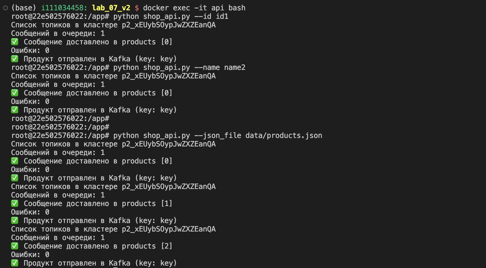

Результат в UI:

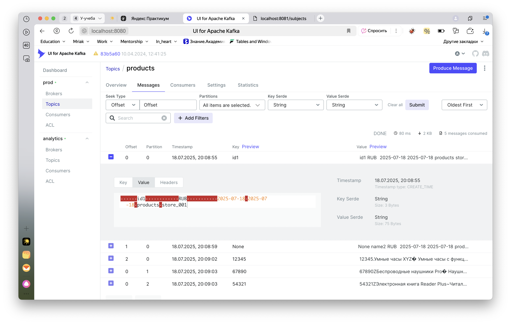

### CLIENT API

CLIENT API — сервис для взаимодействия пользователей с аналитической системой. Отправляет запросы в топики analytics-кластера Kafka:

* `product_requests` — запросы информации о товарах
* `recommendation_requests` — запросы рекомендаций

| Тип запроса               | Топик Kafka               | Поля (обязательные *) | Описание                                                 |
| :------------------------ | :------------------------ | :-------------------- | :------------------------------------------------------- |
| **ProductRequest**        | `product_requests`        | `product_id`*         | Запрос деталей товара                                    |
| **RecommendationRequest** | `recommendation_requests` | —                     | Запрос рекомендаций (с фильтром по `product_id` или без) |

Общие для всех запросов:

* `request_id` (UUID) — уникальный ID запроса
* `timestamp` (ISO-дата) — время создания
* `api_name` ("client_api") — идентификатор сервиса
* `request_type` — тип запроса (product_info / recommendations)

Специфичные поля (для RecommendationRequest):

* `limit` (default: 5) — количество рекомендаций
* `product_id` (опционально) — основа для персонализации

API поддерживает два варианта запросов:

1. Получение информации по товару `python client_api.py product --id <ID>`
2. Получение рекомендаций `python client_api.py recommend --id <ID> --limit <LIMIT>`

Особенности отправки в Kafka:

* В результате данные отправляются в Kafka в Avro-формате (схемы зарегистрированы в Schema Registry)
* Данные отправляются в топики `product_requsts` и `recommendation_requests`
* Используется SSL-аутентификация (настройки в common.py)

Запуск и тестирование:

```bash
docker-compose -f docker-compose-app.yml up -d
docker exec -it api bash

python client_api.py product --id id1
python client_api.py recommend --id id1 --limit 3
```

Результат:

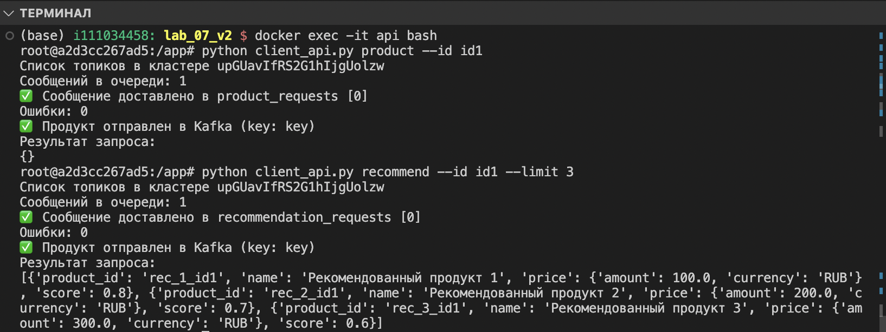

### ADMIN API

ADMIN API — сервис для административного управления списком запрещённых товаров. Отправляет команды в топик requests_to_block_products prod-кластера Kafka, которые обрабатываются block_products_app.

Ключевые характеристики:

| Параметр             | Значение                           |
| :------------------- | :--------------------------------- |
| **Тип запросов**     | Добавление/удаление из блок-листа  |
| **Топик Kafka**      | `requests_to_block_products`       |
| **Кластер**          | PROD (основной)                    |
| **Аутентификация**   | SSL + ACL (только для `admin_api`) |
| **Формат сообщений** | JSON                               |

Сервис поддерживает команды:

| Команда        | Аргумент   | Действие             | Пример вызова                         |
| :------------- | :--------- | :------------------- | :------------------------------------ |
| **Добавление** | `--add`    | Блокировка товара    | `python admin_api.py --add abc123`    |
| **Удаление**   | `--remove` | Разблокировка товара | `python admin_api.py --remove xyz789` |

Структура сообщений в Kafka (ключ сообщения: product_id):

```json
{
  "action": "add" | "remove",
  "product_id": "string" (обязательный)
}
```

Запуск и тестирование:

```bash
docker-compose -f docker-compose-app.yml up -d
docker exec -it api bash

python admin_api.py --add id1
python admin_api.py --add id2
python admin_api.py --remove id1
```

Результат в терминале:

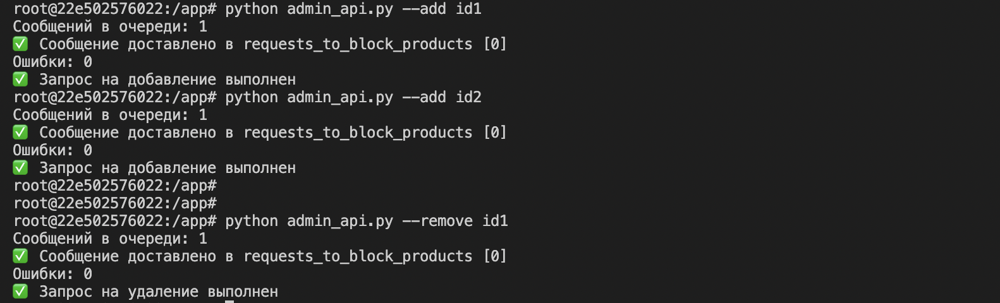

Результат в UI:

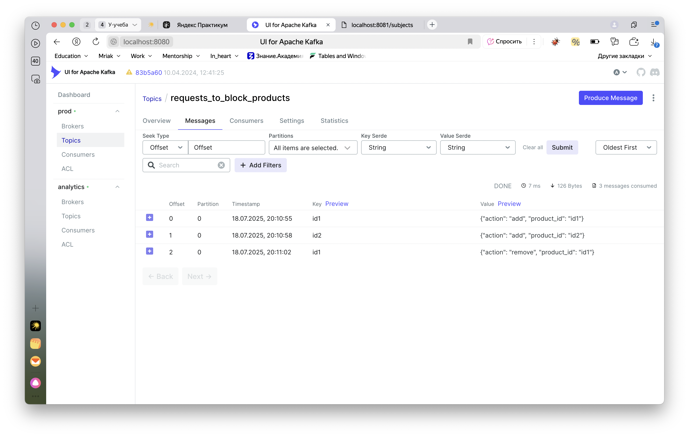

## Настройка фильтрации продуктов

Приложение `block_products_app` реализует потоковую фильтрацию товаров в реальном времени:

* Читает товары из топика `products`
* Фильтрует запрещённые товары (на основе блок-листа)
* Отправляет разрешённые товары в топик `filtered_products`

### Архитектура решения

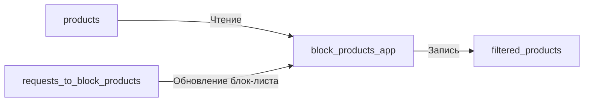
```mermaid
flowchart LR
    A[products] -->|Чтение| B[block_products_app]
    C[requests_to_block_products] -->|Обновление блок-листа| B
    B -->|Запись| D[filtered_products]
```

Гарантии:

* Атомарность операций (блокировка потоков Faust)
* Устойчивость к сбоям (состояние сохраняется в RocksDB)

Схемы Avro:

* Вход: `products.avsc`
* Выход: `filtered_products.avsc`

Логирование:

* Запись действий в stdout 

### Ключевые компоненты

Подключение к Kafka:

| Параметр            | Значение                                       |
| :------------------ | :--------------------------------------------- |
| **Сертификаты SSL** | `/app/ssl/{APP_NAME}/` (клиентский cert + key) |
| **Брокеры**         | `PROD_KAFKA_BOOTSTRAP_SERVERS` (из env)        |
| **Сериализация**    | Avro через Schema Registry                     |

Топики:

| Топик                        | Назначение                                 |
| :--------------------------- | :----------------------------------------- |
| `products`                   | Входной поток товаров                      |
| `filtered_products`          | Отфильтрованные товары                     |
| `requests_to_block_products` | Команды обновления блок-листа (add/remove) |

Таблицы:

| Таблица     | Тип    | Назначение                          |
| :---------- | :----- | :---------------------------------- |
| `block_ids` | `list` | Хранение ID заблокированных товаров |

### Запуск и тестирование 

В общем случае тестирование проводится через CLI:

```bash
docker exec -it api bash

python shop_api.py --id 123
python client_api.py product --id 123   # должен успешно выдать информацию о товаре

python admin_api.py --add 345
python shop_api.py --id 345
python client_api.py product --id 345   # пустой вывод, так как товар в списке удаленных
```

#### Результат обработки запросов на блокировку / разблокировку

В терминале:

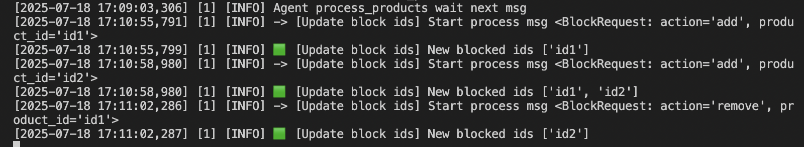

В UI кафки видим лог изменений состояний таблицы с заблокированными ID:

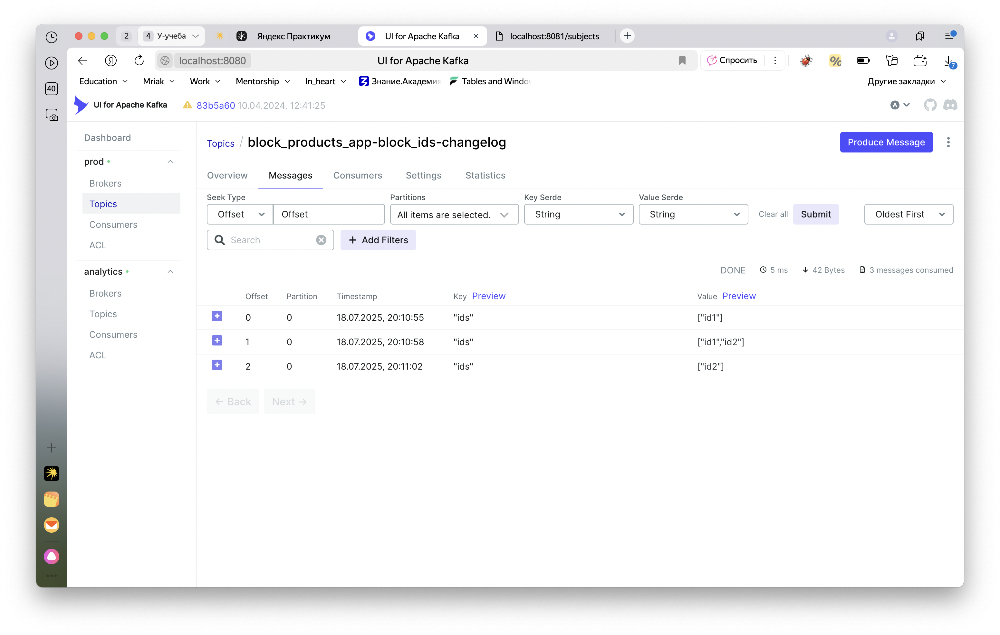

#### Результат фильтрации

Тест:

* отправить продукт с ID = 345 (должен успешно отправиться в топик `filtered_products`)
* заблокировать ID 345
* снова отправить продукт с ID = 345 (НЕ должен отправиться в топик `filtered_products`)

Результат в терминале (логи контейнера `block_products_app`):

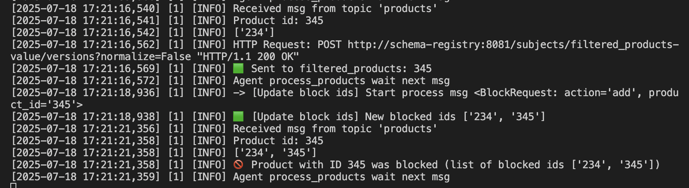

Результат в UI (как и ожидалось, только в топик `filtered_products` сообщение пришло только один раз):

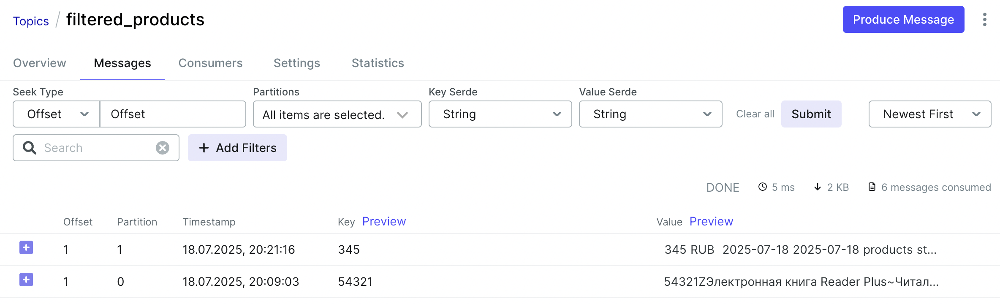

## Настройка мониторингов 

Система мониторинга состоит из 4 ключевых компонентов, развернутых в Docker:

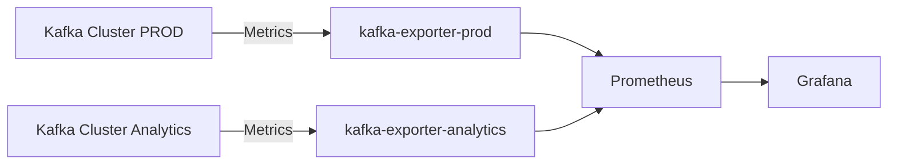
```mermaid
flowchart LR
    A[Kafka Cluster PROD] -->|Metrics| B[kafka-exporter-prod]
    C[Kafka Cluster Analytics] -->|Metrics| D[kafka-exporter-analytics]
    B --> E[Prometheus]
    D --> E
    E --> F[Grafana]
```

### Компоненты системы

#### Kafka Exporter (2 инстанса)

| Параметр           | PROD-кластер                         | Analytics-кластер           |
| :----------------- | :----------------------------------- | :-------------------------- |
| **Порт**           | 9308 (Host: 9308)                    | 9309 (Host: 9308)           |
| **Брокеры**        | prod-broker1:9092, prod-broker2:9092 | analytics-broker1:9092, ... |
| **SSL**            | Включен (клиентские сертификаты)     | Аналогично PROD             |
| **Фильтр топиков** | Все (`--topic.filter=.*`)            | Все (`--topic.filter=.*`)   |

Собираемые метрики:

* Lag потребителей
* Throughput (вход/выход)
* Размер топиков
* Статус брокеров

Пример метрик:

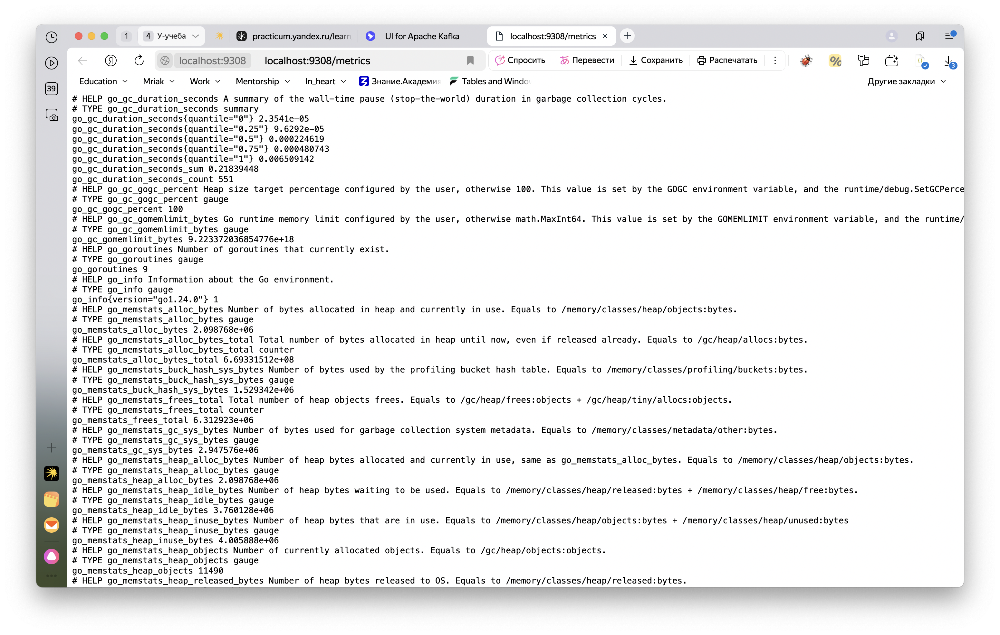

#### Prometheus

| Настройка         | Значение                                                |
| :---------------- | :------------------------------------------------------ |
| **Конфиг**        | `./config/prometheus/prometheus.yml`                    |
| **Порт**          | 9090                                                    |
| **Частота сбора** | 15s (по умолчанию)                                      |
| **Targets**       | kafka-exporter-prod:9308, kafka-exporter-analytics:9308 |

Результат настройки:

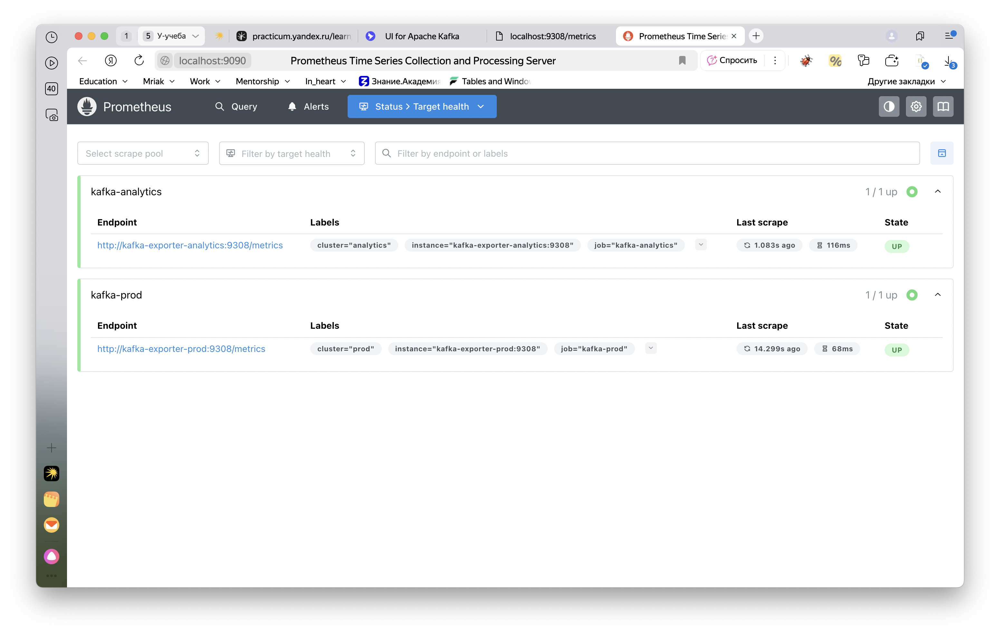

#### Grafana

| Параметр            | Значение                                                     |
| :------------------ | :----------------------------------------------------------- |
| **Порт**            | 3000                                                         |
| **Логин/пароль**    | admin/admin                                                  |
| **Источник данных** | Prometheus ([http://prometheus:9090](http://prometheus:9090/)) |
| **Дашборды**        | `./config/grafana` |

В результате построены два идентичных дашборда (для Prod и для Analytics кластера):

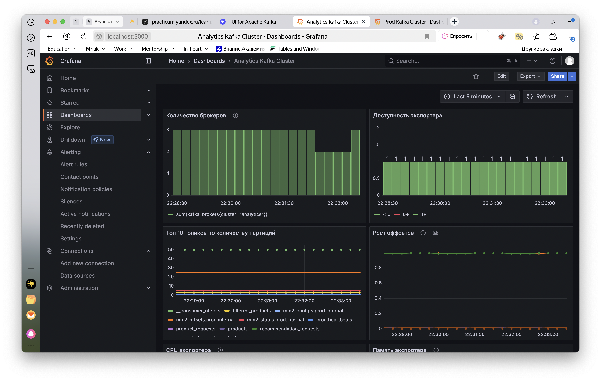

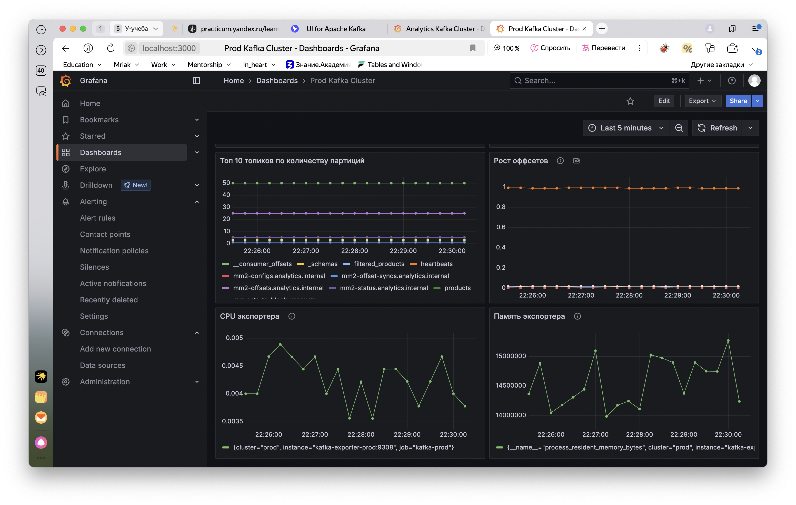

TLS для экспортеров:

* Сертификаты из ./ssl/kafka-exporter/
* Общий CA (ca.crt) для проверки брокеров

ACL в Kafka: 
* Экспортеры имеют права DESCRIBE и READ на все топики.

#### Alert Mannager

Настроена проверка на количество брокеров в кластере:

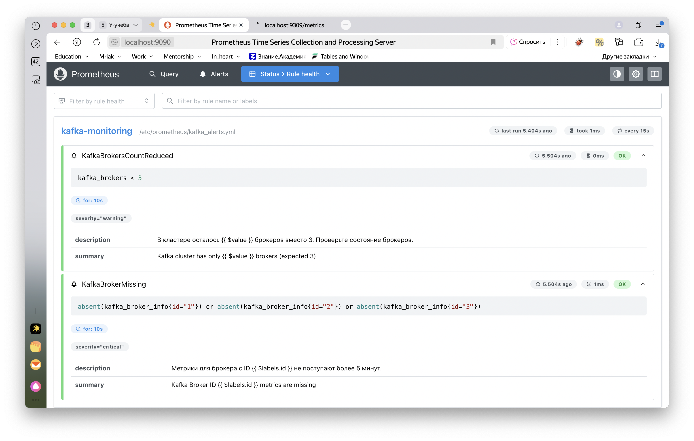

Один из блокеров остановлен, пришел алерт:

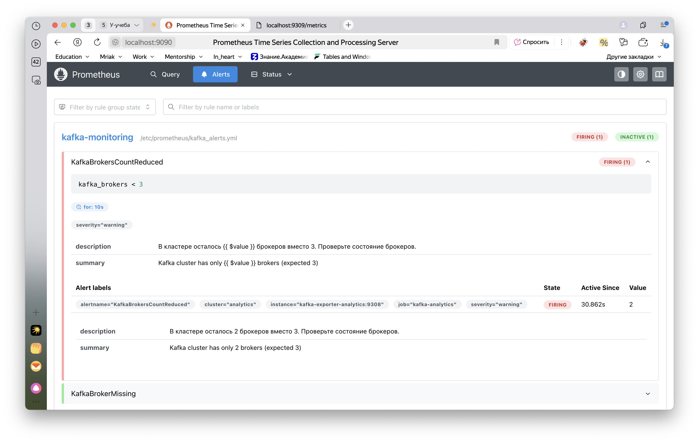

## Настройка Kafka Connect для записи данных в БД (файл)

Коннектор filtered-products-file-sink реализует sink-интеграцию, сохраняя данные из топика filtered_products в файл /tmp/file-sink/filtered_products.txt. Это демонстрирует базовый сценарий переноса данных из Kafka во внешнюю систему.

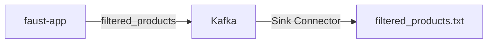
```mermaid
flowchart LR
    A[faust-app] -->|filtered_products| B[Kafka]
    B -->|Sink Connector| C[filtered_products.txt]
```

Особенности реализации:

| Параметр               | Значение                | Описание           |
| :--------------------- | :---------------------- | :----------------- |
| **Тип коннектора**     | Sink (FileStreamSink)   | Запись в файл      |
| **Сериализация**       | Avro + Schema Registry  | Валидация схемы    |
| **Формат вывода**      | JSON                    | Читаемый вид       |
| **Обработка ошибок**   | `errors.tolerance=none` | Жесткая валидация  |
| **Производительность** | `batch.size=100`        | Оптимизация записи |

Безопасность:

* SSL-аутентификация к кластеру Kafka
* Подключение к Schema Registry (HTTP)
* Изолированный том для файлов (./tmp_data/kafka-connect)

Запуск:

```bash
docker-compose -f docker-compose-connect.yml
curl -X POST -H "Content-Type: application/json" -d @./config/kafka-connect/config.json http://localhost:8083/connectors
```

После успешной регистрации статус коннектора доступен по адресу http://localhost:8083/connectors/filtered-products-file-sink/status:

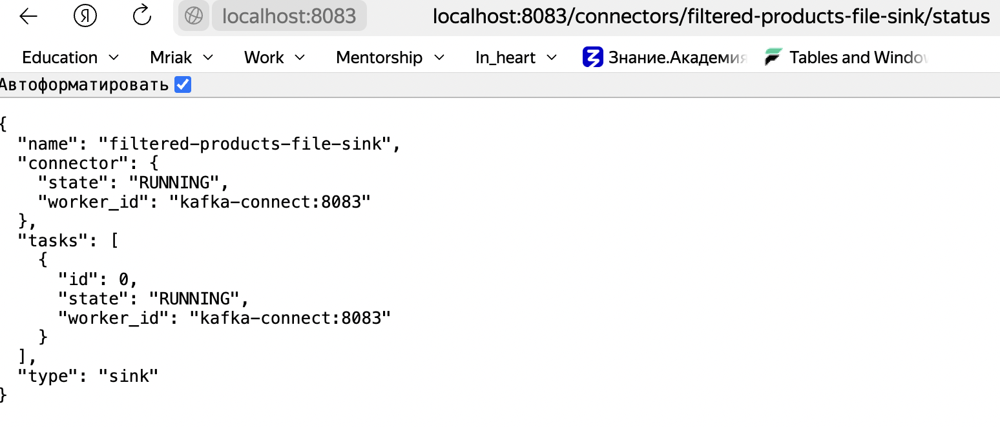

При необходимости удалить коннектор можно так:

```bash
curl -X DELETE http://localhost:8083/connectors/filtered-products-file-sink # если необходимо
```

Результат в файле `./tmp_data/kafka-connect/filtered_products.txt`:

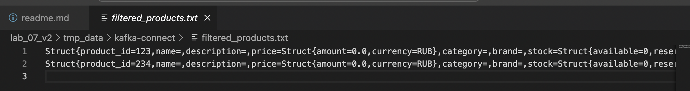

## Тестирование API -> KAFKA -> BLOCK_APP -> CONNECTOR -> FILE -> API

[SUCCESS] Создание товара через SHOP API и получение о нем информации через CLIENT API:

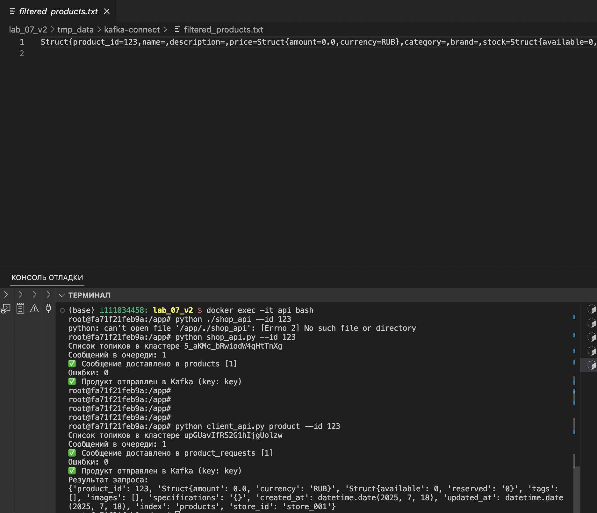

[SUCCESS] Блокировка ID -> создание товара -> информацию о нем через CLIENT API получить не удается:

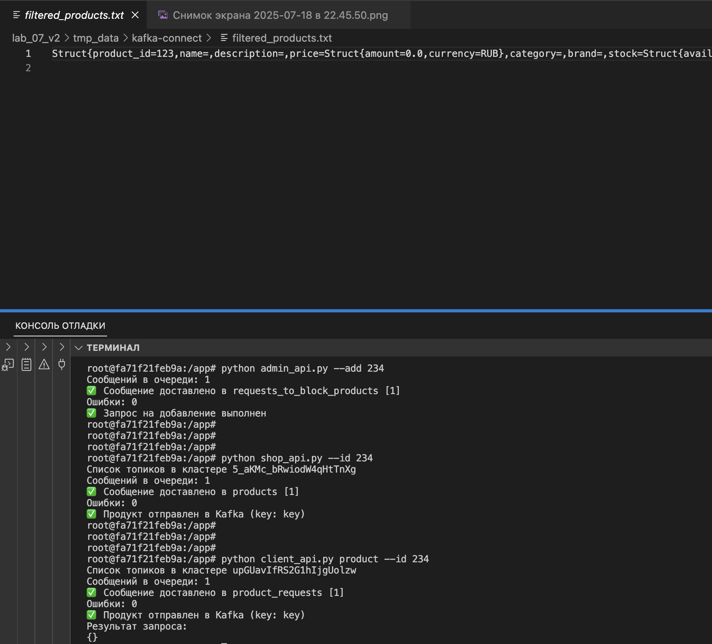

[SUCCESS] Разблокировка ID -> создание товара -> информация через CLIENT API получена:

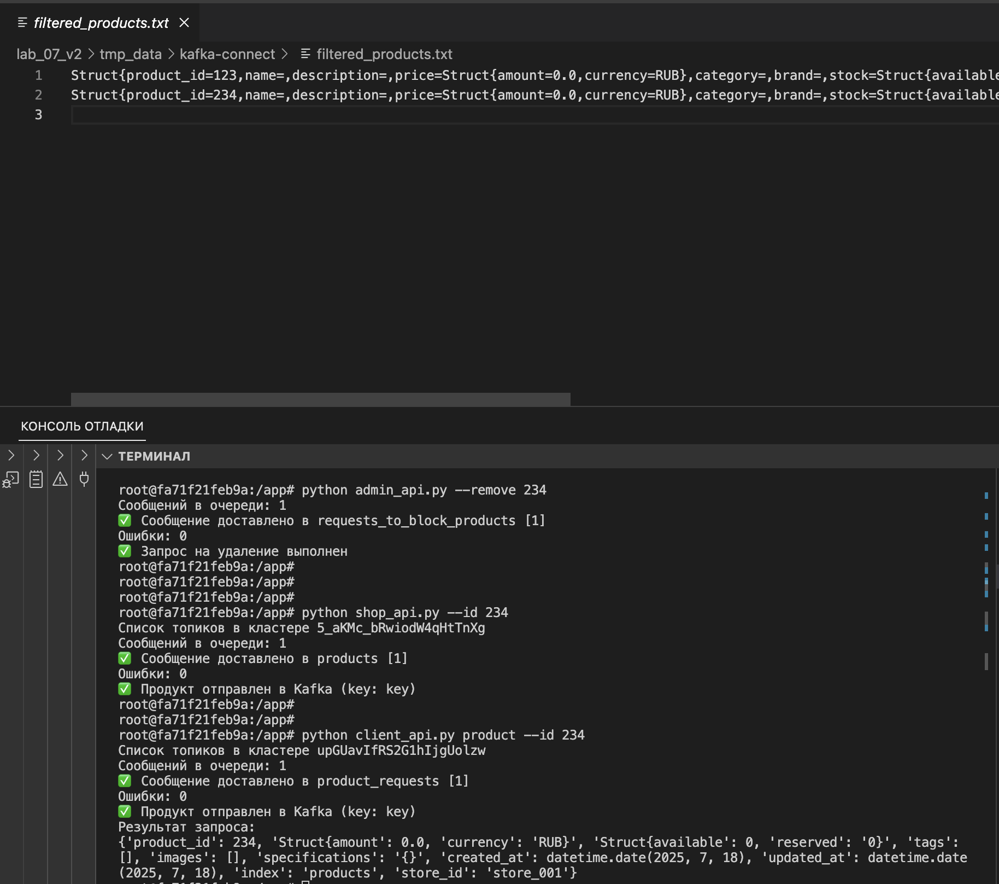

## Итог

Учебный проект имитирует реальный продакшен-стек с Kafka в ядре, обеспечивая:

* ✅ Безопасность (TLS + ACL)
* ✅ Масштабируемость (3 брокера на кластер)
* ✅ Надёжность (репликация + мониторинг)

Тестовый контур позволяет отработать настройку всех компонентов перед развёртыванием в продакшене.
